# Descriptive Statistics

## Table of Contents

1.  **Measure of Central Tendency**
    *   Mean
    *   Median
    *   Mode
    *   Weighted Mean
    *   Trimmed Mean
2.  **Measure of Dispersion**
    *   Range
    *   Variance
    *   Standard Deviation
    *   Coefficient of Variation (CV)
    *   Interquartile Range (IQR)
3.  **Plotting Graphs in Statistics**
    *   Graphs for Univariate Analysis
        *   Categorical Data
        *   Numerical Data Visualization
    *   Graphs for Bivariate Analysis
        *   Categorical - Categorical Variables
        *   Numerical - Numerical Variables
        *   Categorical - Numerical Variables
4.  **Five Number Summary and Box Plot**
    *   Calculating Percentile
    *   Boxplot Using Python
5.  **Covariance and Correlation**
    *   Covariance
    *   Correlation
6.  **Graphs for Multivariate Analysis**
    *   3D Scatter Plot
    *   Hue Parameter in Seaborn
    *   FacetGrids
    *   Pair Plots
    *   Bubble Plot

---

# Chapter 1 — Measure of Central Tendency (Full Detailed Explanation)

**Topics covered in this chapter:**
*   Mean
*   Median
*   Mode
*   Weighted Mean
*   Trimmed Mean
*   Why central tendency matters in ML

---

## ⭐ 1. Mean (Arithmetic Average)

### Definition
The mean is the sum of all values divided by the number of values. It represents the "center of gravity" of the data.

$$
\mu = \frac{\sum_{i=1}^{n} x_i}{n}
$$

### Example Dataset
Suppose you have students’ CGPA:

| Student | CGPA |
| :--- | :--- |
| A | 3.0 |
| B | 3.5 |
| C | 2.8 |
| D | 3.7 |
| E | 3.0 |

**Calculation:**
$$
\mu = \frac{3.0 + 3.5 + 2.8 + 3.7 + 3.0}{5}
$$
$$
\mu = \frac{16.0}{5} = 3.2
$$

**Interpretation:**
The average CGPA is **3.2**.

### Visualization
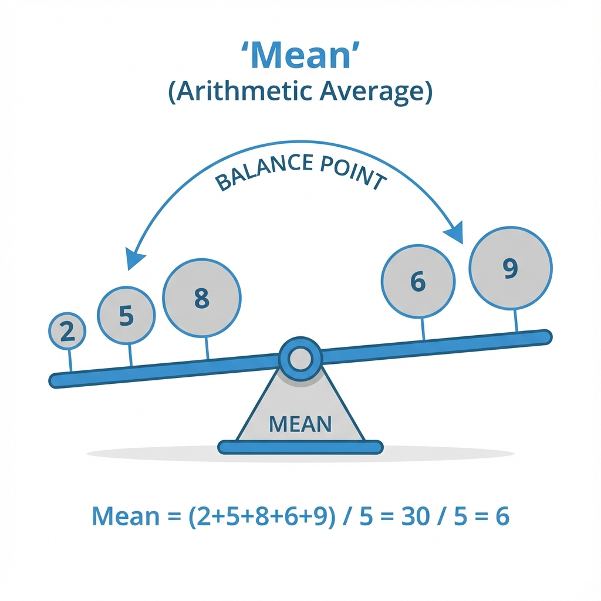

### Why it is Important
*   **Summarizes Data:** Provides a single value that represents the entire dataset.
*   **Basis for Other Metrics:** Essential for calculating Variance, Standard Deviation, and Correlation.
*   **Minimizes Error:** The sum of squared deviations from the mean is minimal compared to any other number.

### Why it is Needed in ML
*   **Data Imputation:** Filling missing numerical values with the mean is a common strategy.
*   **Feature Scaling:** Used in **Standardization (Z-score normalization)** ($x' = \frac{x - \mu}{\sigma}$), which is crucial for algorithms like SVM, KNN, and Neural Networks to converge faster.
*   **Model Evaluation:** Metrics like **MSE (Mean Squared Error)** rely on the mean of errors to quantify model performance.

---

## ⭐ 2. Median

### Definition
The median is the middle value when data is sorted. It splits the data into two equal halves.

### Steps
1.  Sort the data.
2.  Find the middle value.
3.  If even number of values → average of middle two.

### Example
**Raw Data:** 3.0, 3.5, 2.8, 3.7, 3.0
**Sorted Data:** 2.8, 3.0, **3.0**, 3.5, 3.7

**Median = 3.0**

### Visualization
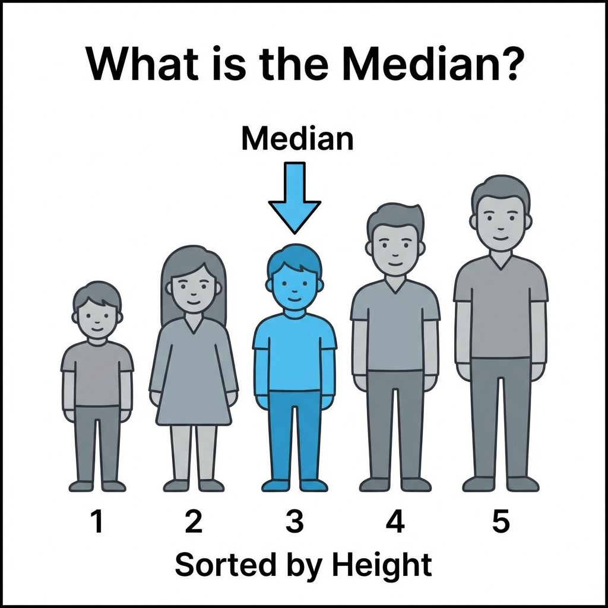

### Why it is Important
*   **Robustness:** Unlike the mean, the median is not skewed by extreme outliers.
*   **Real-World Representation:** Better represents the "typical" value in skewed distributions (e.g., Household Income, House Prices).

### Why it is Needed in ML
*   **Robust Imputation:** Preferred over mean for filling missing values when the data has outliers.
*   **Loss Functions:** **MAE (Mean Absolute Error)** is optimized by the median, making it robust to outliers in regression tasks.
*   **Anomaly Detection:** Used in **Median Absolute Deviation (MAD)** to detect outliers effectively.

---

## ⭐ 3. Mode

### Definition
The mode is the value that occurs most frequently in the dataset.

### Example
**CGPA values:** 3.0, **3.0**, 3.5, 3.7, 2.8
**Mode = 3.0** (appears twice)

### Visualization
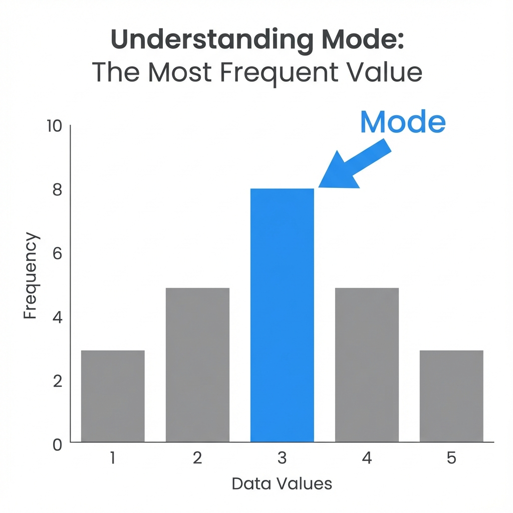

### Why it is Important
*   **Categorical Analysis:** The only measure of central tendency that works for non-numerical (nominal) data.
*   **Business Insight:** Identifies the most popular product, most common error type, etc.

### Why it is Needed in ML
*   **Categorical Imputation:** The standard method for filling missing values in categorical features.
*   **Classification Baseline:** The "Zero Rule" baseline model predicts the mode (most frequent class) to set a benchmark accuracy.
*   **K-Nearest Neighbors (KNN):** In classification, KNN predicts the class based on the **mode** of the k-nearest neighbors.

---

## ⭐ 4. Weighted Mean

### Definition
In some cases, not all observations contribute equally. Each data point has a **weight** ($w_i$) representing its importance.

$$
\text{Weighted Mean} = \frac{\sum w_i x_i}{\sum w_i}
$$

### Example
Your semester grades with different credit hours:

| Subject | Grade ($x_i$) | Credit ($w_i$) |
| :--- | :--- | :--- |
| Math | 3.7 | 4 |
| AI | 3.3 | 3 |
| Statistics | 3.0 | 3 |

**Calculation:**
$$
\frac{(3.7 \times 4) + (3.3 \times 3) + (3.0 \times 3)}{4 + 3 + 3}
$$
$$
= \frac{14.8 + 9.9 + 9.0}{10} = \frac{33.7}{10} = 3.37
$$

**Your weighted GPA = 3.37**

### Visualization


### Why it is Important
*   **Fair Representation:** Accounts for the varying significance or reliability of different data points.
*   **Physics & Engineering:** Used to calculate Center of Mass.

### Why it is Needed in ML
*   **Ensemble Learning:** In **Boosting** and **Random Forests**, predictions from better-performing models are given higher weights.
*   **Class Imbalance:** Weighted loss functions assign higher weights to the minority class to prevent the model from ignoring it.
*   **Time-Series Forecasting:** Recent data points are often given higher weights than older ones (Exponential Moving Average).

---

## ⭐ 5. Trimmed Mean

### Definition
The trimmed mean removes a small percentage of the largest and smallest values before calculating the mean. This makes it robust to outliers.

### Example (10% trimmed mean)
**Data:** 10, 11, 12, 13, 14, **100** (Outlier)

1.  Remove top 10% and bottom 10%.
2.  Remaining: 11, 12, 13, 14.
3.  **Mean = 12.5** (Much closer to the "real" center than the raw mean).

### Visualization
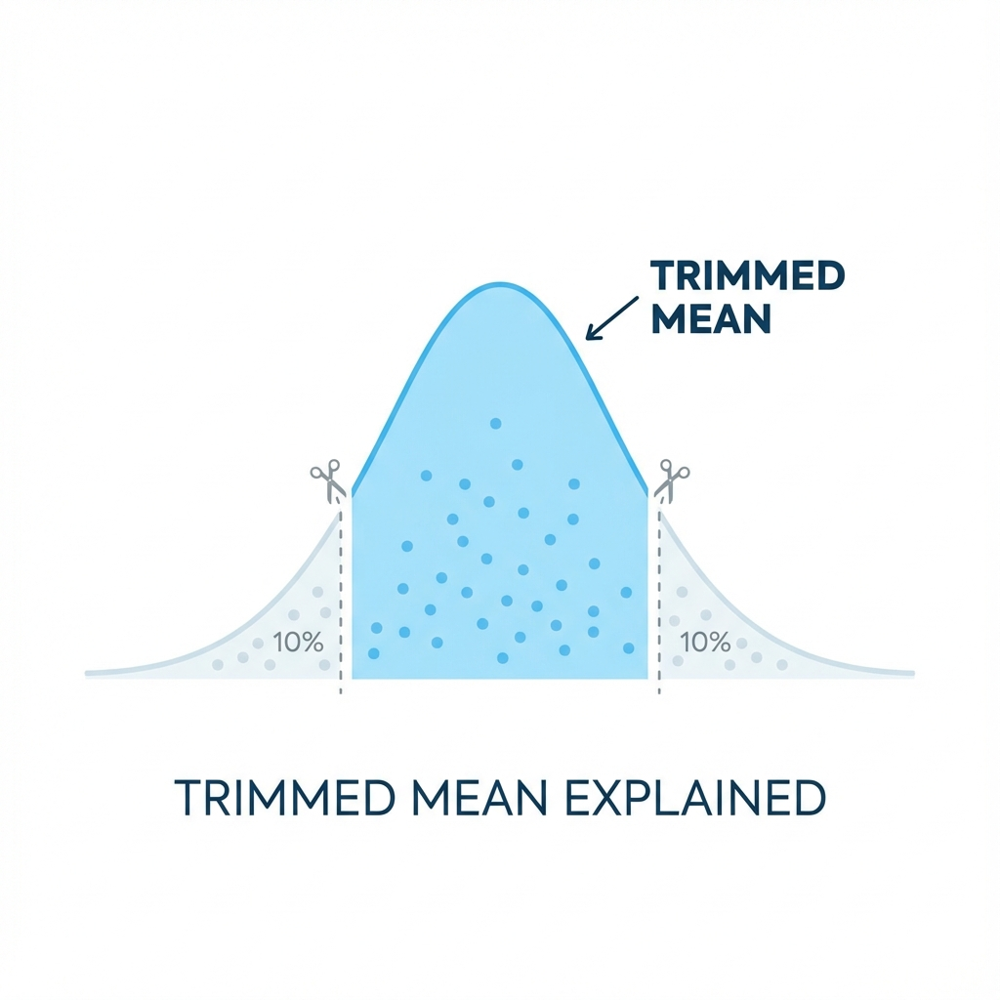

### Why it is Important
*   **Compromise:** Offers a middle ground between the Mean (efficient but sensitive) and Median (robust but ignores magnitude).
*   **Sports Scoring:** Used in Olympics (diving, gymnastics) to remove biased judging (highest and lowest scores dropped).

### Why it is Needed in ML
*   **Robust Regression:** Algorithms like **RANSAC** use similar principles to ignore outliers during model training.
*   **Metric Stability:** Calculating trimmed means of evaluation metrics during cross-validation ensures that one bad fold doesn't skew the overall performance assessment.
*   **Noise Reduction:** Effective in signal processing and sensor data cleaning before feeding into ML models.

---

## ⭐ 6. Why Central Tendency Matters in Machine Learning

ML relies heavily on central tendency for:

### 1. Normalization
$$
x' = \frac{x - \text{mean}}{\text{std}}
$$
Used in: Neural Networks, SVM, Logistic Regression, K-Means.

### 2. Feature Understanding
*   Helps in detecting **skewness**.
*   Understanding **distribution**.
*   **Outlier detection**.

### 3. Loss Functions Are Based on Means
*   **Mean Absolute Error (MAE)**
*   **Mean Squared Error (MSE)**
*   **Root Mean Squared Error (RMSE)**

---

# ⭐ **CHAPTER 2 — MEASURES OF DISPERSION (FULL DETAILED EXPLANATION)**

Dispersion tells us **how spread out the data is**.
Central tendency (mean/median/mode) tells you **where the center is**, but **dispersion tells you how variable or stable** your data is.

**Topics covered in this chapter:**
1.  **Range**
2.  **Variance**
3.  **Standard Deviation (SD)**
4.  **Coefficient of Variation (CV)**
5.  **Interquartile Range (IQR)**
6.  **Why dispersion matters in Machine Learning**

---

## ⭐ 1. RANGE

### Definition
Range is the **difference between the maximum and minimum** value.

$$
\text{Range} = \max(x) - \min(x)
$$

### Example
**IQ scores:** 85, 90, 95, 100, 110, 120

$$
\text{Range} = 120 - 85 = 35
$$

### Visualization
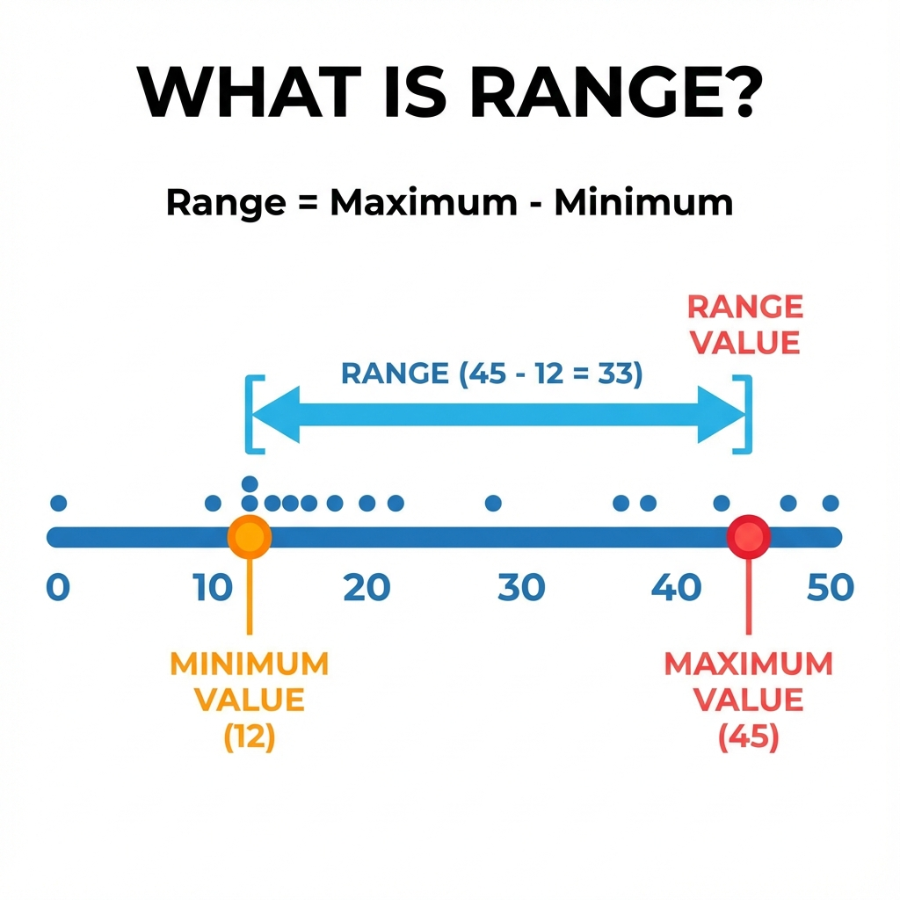

### Why it is Important
*   **Simplicity:** The easiest way to get a quick sense of the data's spread.
*   **Boundary Detection:** Immediately identifies the limits of the dataset.

### Why it is Needed in ML
*   **Feature Scaling:** Used in **Min-Max Normalization** ($x' = \frac{x - \min}{\max - \min}$) to scale features to a fixed range [0, 1].
*   **Anomaly Detection:** Extreme range values can indicate data entry errors or anomalies.
*   **Data Validation:** Ensuring new data falls within the expected range of training data.

---

## ⭐ 2. Variance ($\sigma^2$)

### Definition
Variance tells **how far each data point is from the mean** on average. It measures the average squared deviation.

$$
\sigma^2 = \frac{\sum (x_i - \mu)^2}{n}
$$

### Example
**Dataset:** 5, 7, 9
**Mean:** 7

| $x$ | $x - \mu$ | $(x - \mu)^2$ |
| :--- | :--- | :--- |
| 5 | -2 | 4 |
| 7 | 0 | 0 |
| 9 | 2 | 4 |

$$
\sigma^2 = \frac{4 + 0 + 4}{3} = \frac{8}{3} = 2.67
$$

### Visualization
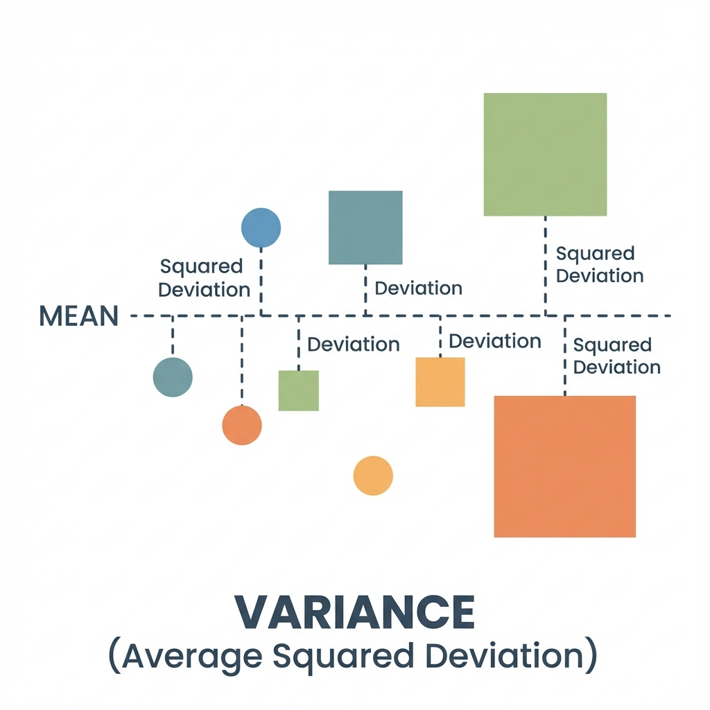

### Why it is Important
*   **Mathematical Foundation:** The basis for Standard Deviation, Covariance, and Correlation.
*   **Risk Assessment:** In finance, variance measures the volatility (risk) of an asset.

### Why it is Needed in ML
*   **Principal Component Analysis (PCA):** PCA reduces dimensionality by finding directions (principal components) that maximize **variance** (information).
*   **Feature Selection:** Features with near-zero variance carry little information and are often dropped.
*   **Bias-Variance Tradeoff:** A core concept in ML; high variance models (overfitting) capture noise, while low variance models (underfitting) miss patterns.

---

## ⭐ 3. Standard Deviation (SD)

### Definition
SD is the **square root of variance**. It brings the measure of spread back to the original unit of the data.

$$
\sigma = \sqrt{\sigma^2}
$$

### Example
Using previous variance of 2.67:
$$
\sigma = \sqrt{2.67} = 1.63
$$

### Visualization
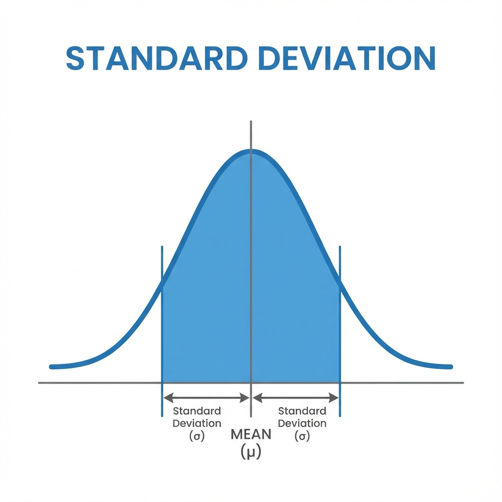

### Why it is Important
*   **Interpretability:** Unlike variance, SD is in the same units as the data (e.g., "spread of $10" vs "variance of $100^2").
*   **Normal Distribution:** In a normal distribution, ~68% of data lies within $\mu \pm 1\sigma$.

### Why it is Needed in ML
*   **Standardization:** Used to scale features to have $\mu=0$ and $\sigma=1$ ($x' = \frac{x - \mu}{\sigma}$), essential for gradient descent optimization.
*   **Weight Initialization:** Methods like **Xavier** and **He** initialization use SD to set initial weights, preventing vanishing/exploding gradients.
*   **Outlier Detection:** Z-score method identifies outliers as points beyond $\pm 3\sigma$.

---

## ⭐ 4. Coefficient of Variation (CV)

### Definition
CV measures **relative spread**. It is unitless, allowing comparison of variability between datasets with different scales.

$$
CV = \frac{\sigma}{\mu}
$$

### Example
*   **Dataset A:** Mean = 50, SD = 10 $\rightarrow CV = 0.2$
*   **Dataset B:** Mean = 100, SD = 10 $\rightarrow CV = 0.1$
*   **Dataset B is more stable.**

### Visualization
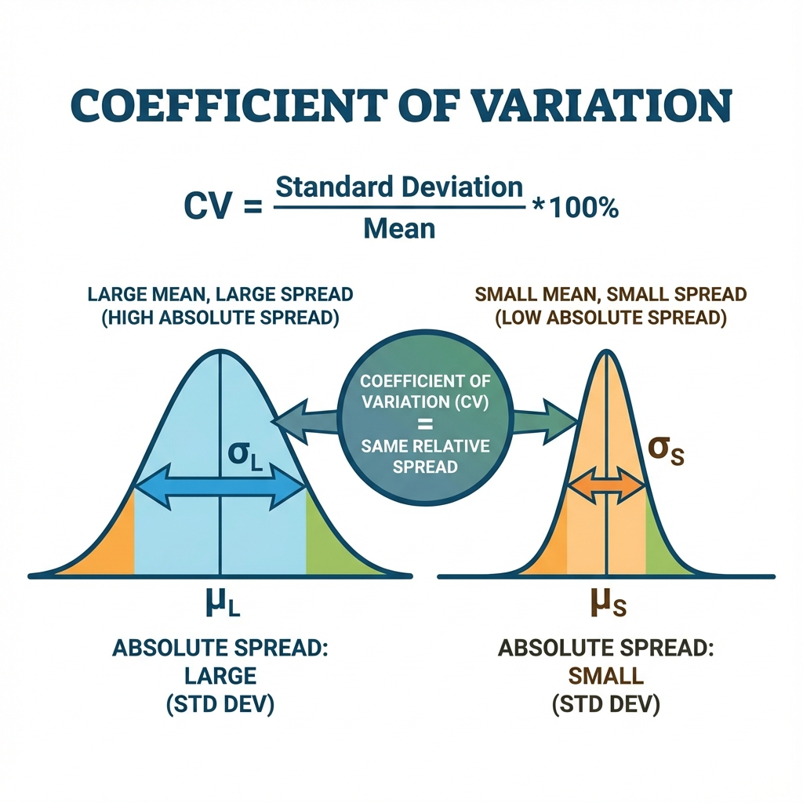

### Why it is Important
*   **Comparability:** Allows comparing the volatility of stocks with different prices or the variability of height vs weight.

### Why it is Needed in ML
*   **Feature Selection:** Helps identify features that are relatively stable vs highly volatile regardless of their magnitude.
*   **Model Stability:** Comparing CV of model performance metrics across cross-validation folds to assess stability.

---

## ⭐ 5. Interquartile Range (IQR)

### Definition
IQR measures the spread of the **middle 50%** of the data. It is the difference between the 75th percentile (Q3) and the 25th percentile (Q1).

$$
IQR = Q3 - Q1
$$

### Example
**Data:** 4, 7, 8, 10, 12, 15, 18, 21
**Q1 (25%):** 8
**Q3 (75%):** 18

$$
IQR = 18 - 8 = 10
$$

### Visualization
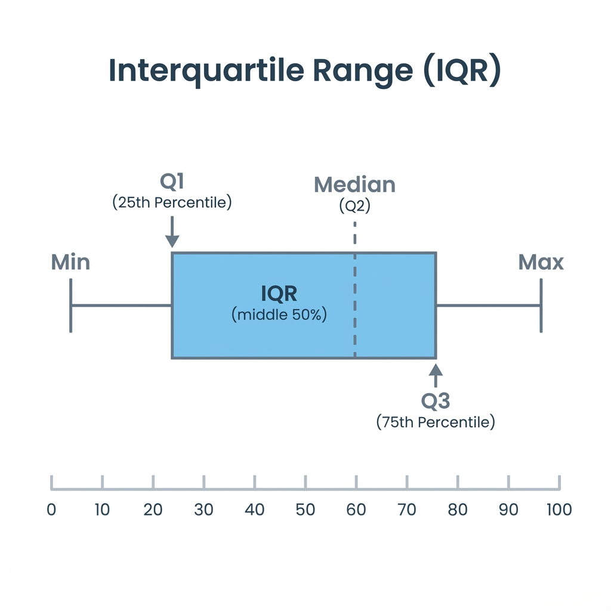

### Why it is Important
*   **Robustness:** Like the median, IQR is not affected by extreme outliers.
*   **Data Distribution:** Gives a clear picture of where the bulk of the data lies.

### Why it is Needed in ML
*   **Outlier Removal:** The **IQR Rule** (Values < $Q1 - 1.5IQR$ or > $Q3 + 1.5IQR$) is a standard robust method for detecting and removing outliers.
*   **Robust Scaling:** Scaling features using median and IQR ($x' = \frac{x - Q1}{IQR}$) is preferred when data contains many outliers.
*   **Box Plots:** The core component of box plots, used extensively in EDA.

---

## ⭐ Final Section: Why Dispersion Matters in Machine Learning

Dispersion measures are **critical** in ML for:

1.  **Feature Scaling:** Algorithms like SVM, KNN, and Neural Networks require scaled data (using Range or SD) to function correctly.
2.  **Gradient Behavior:** The variance of weights affects signal propagation in Deep Networks (Vanishing/Exploding gradients).
3.  **Outlier Detection:** SD and IQR are the primary tools for identifying anomalies that can skew models.
4.  **Bias-Variance Tradeoff:** Understanding the variance of model predictions is key to diagnosing overfitting.
5.  **Dimensionality Reduction:** PCA relies entirely on maximizing variance to preserve information.

---

# ⭐ **CHAPTER 3 — Plotting Graphs in Statistics (Full Deep Explanation)**

**Topics covered in this chapter:**
1.  **Univariate Analysis** (Categorical & Numerical)
2.  **Bivariate Analysis** (Categorical-Categorical, Numerical-Numerical, Categorical-Numerical)
3.  **Multivariate Analysis** (3D Scatter, Hue, FacetGrid, Pair Plot, Bubble Plot)
4.  **ML Importance for Each Plot Type**

---

# ⭐ PART 1 — UNIVARIATE ANALYSIS

Univariate = analyzing **ONE** feature at a time.
Used to understand: **Distribution, Shape, Outliers, Frequency**.

## ⭐ 1. CATEGORICAL DATA (Univariate)

Categorical variables represent **groups/categories** (e.g., Gender, Yes/No, Placement Status).

### A. Bar Chart
Shows **frequency** of categories.

**Example:**
*   Placed: 70
*   Not Placed: 30

**Visualization:**
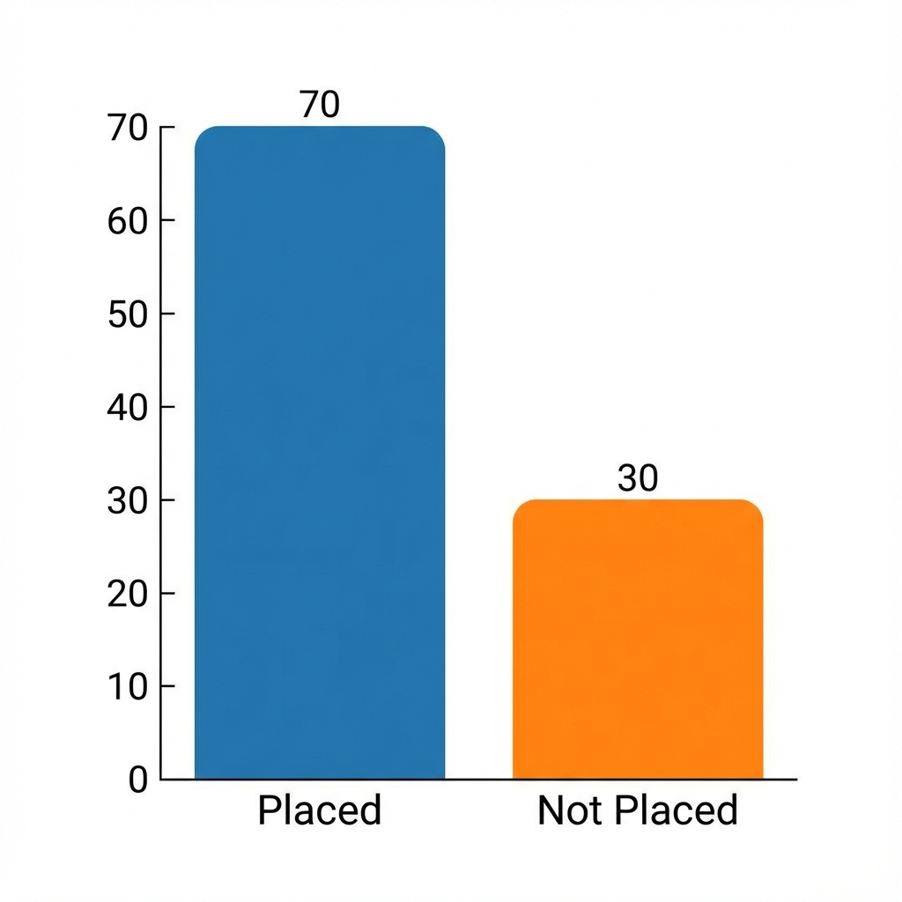

**Why use it?**
*   Easy to compare categories.
*   Useful for imbalanced datasets.

**ML Relevance:**
*   **Class Imbalance Detection:** Essential for identifying if one class dominates (e.g., Fraud Detection).
*   **Sampling Strategy:** Guides decisions on Oversampling (SMOTE) or Undersampling.

### B. Pie Chart
Shows **percentage** contribution.

**Visualization:**
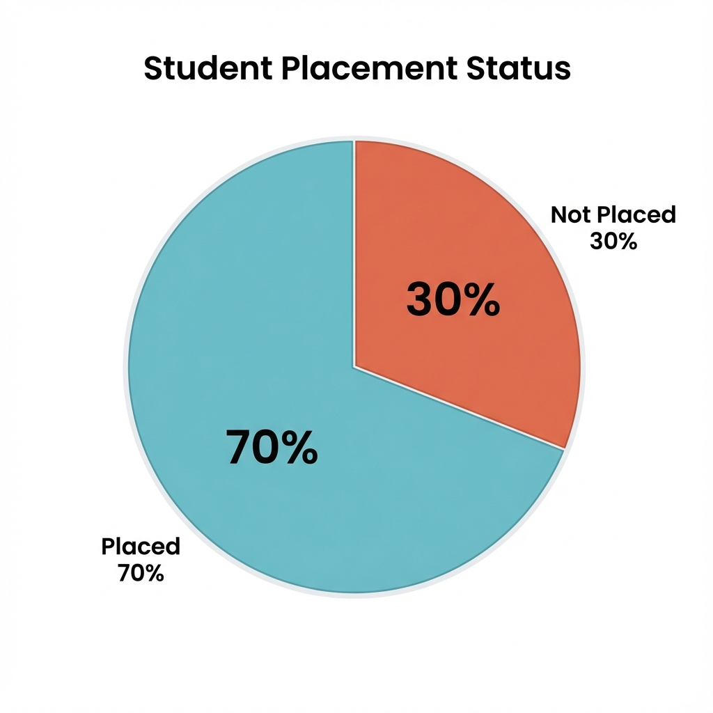

**ML Relevance:**
*   Rarely used in core ML, but helpful for high-level presentations of class distribution.

---

## ⭐ 2. NUMERICAL DATA (Univariate)

Numerical variables include: Age, Salary, CGPA, IQ.

### A. Histogram
Shows the **distribution** of numerical data by grouping them into bins.

**Visualization:**
```
Bins (Salary):
20000–30000 | ████
30000–40000 | ███████████
40000–50000 | ██████████████████
50000–60000 | ████████████
60000–70000 | ██████
```

**What it tells:**
*   **Skewness:** Is the data symmetric, left-skewed, or right-skewed?
*   **Shape:** Is it Normal (Bell curve), Uniform, or Bimodal?
*   **Outliers:** Bars far away from the main group indicate anomalies.

**ML Relevance:**
*   **Normalization:** Skewed data often needs Log Transformation or Box-Cox Transformation to become normal.
*   **Algorithm Selection:** Some models (like Gaussian Naive Bayes) assume normal distribution.

### B. Density Plot / KDE Plot
A smoothed version of a histogram (Kernel Density Estimation).

**Visualization:**
```
              __----__
          _--'        '--_
       _-'               '--_
   ___-'                    '--___
```

**Why useful?**
*   Shows a smooth probability density function.
*   Easier to identify peaks (modes) than histograms.

**ML Relevance:**
*   **Assumption Checking:** Verifies if the data follows a Gaussian distribution.
*   **Probabilistic Modeling:** Used in generative models.

### C. Box Plot (Univariate)
Shows the **Five Number Summary** (Min, Q1, Median, Q3, Max) and outliers.

**Visualization:**
```
    |-----------IQR-----------|
 Q1     Median          Q3

----|-------[====]--------|------
 min                         max
```

**ML Relevance:**
*   **Outlier Detection:** The primary tool for spotting anomalies before training.
*   **Data Cleaning:** Helps decide whether to remove or cap outliers.

---

# ⭐ PART 2 — BIVARIATE ANALYSIS

Bivariate = relationship between **TWO VARIABLES**.

## ⭐ 1. Categorical – Categorical

### A. Clustered Bar Chart
Shows the relationship between two categorical variables (e.g., Gender vs Placement).

**Visualization:**
```
            Placed    Not Placed
Male        ██████     ████
Female      █████████  ██
```

### B. Heatmap (Crosstab)
A color-coded table showing the frequency of combinations.

**Visualization:**
|        | Placed | Not Placed |
| ------ | ------ | ---------- |
| Male   | 40     | 20         |
| Female | 30     | 10         |

**ML Relevance:**
*   **Feature Interaction:** Helps understand how two categorical features interact (e.g., "Females" are more likely to be "Placed" in a specific dataset).

---

## ⭐ 2. Numerical – Numerical

### A. Scatter Plot
Plots data points on X and Y axes to show relationships.

**Visualization:**
```
Salary ↑
       |     ●   ●
       |   ● ● ●
       | ● ●
       |_________________→ IQ
```

**Insights:**
*   **Correlation:** Positive, Negative, or No correlation.
*   **Linearity:** Is the relationship linear or non-linear?
*   **Clusters:** Do natural groups exist?

**ML Relevance:**
*   **Regression:** Essential for checking if a linear regression model will work.
*   **Feature Engineering:** Helps identify if polynomial features are needed.

### B. Line Graph
Used for trends over time (Time Series).

**Visualization:**
```
Price ↑
130 |      /‾‾\__
120 |   __/
110 |__/
     ---------------- Time →
```

---

## ⭐ 3. Categorical – Numerical

### A. Box Plot (Bivariate)
Compares the distribution of a numerical variable across different categories.

**Visualization:**
```
Male:    |--[====]----|
Female:  |----[===]--|
```

**ML Relevance:**
*   **Feature Importance:** If the box plots for different classes are very distinct, the numerical feature is a good predictor.

### B. Violin Plot
Combines a Box Plot and a KDE Plot. Shows distribution shape and summary statistics.

**Visualization:**
> *[Image: Violin Plot - Generation Pending due to Quota Limit]*

---

# ⭐ PART 3 — MULTIVARIATE ANALYSIS

Analyzing **more than two variables**.

## ⭐ 1. 3D Scatter Plot
Adds a Z-axis to visualize three numerical variables.

**Visualization:**
```
           ●
       ●
   ●
----------------------------
  (3D axis representation)
```

**ML Relevance:**
*   **Clustering:** Visualizing how data points separate in higher dimensions (e.g., K-Means results).

## ⭐ 2. Scatter Plot with Hue
Uses **color** to encode a third (categorical) variable on a 2D scatter plot.

**Visualization:**
```
● = Placed (blue)
○ = Not Placed (red)

 IQ →
Salary ↑

   ● ● ○ ● ● ○ ○
```

**ML Relevance:**
*   **Classification Boundaries:** Helps visualize how well two features can separate classes (e.g., Decision Boundary).

## ⭐ 3. Pair Plot
A grid of scatter plots (for numerical pairs) and histograms (diagonal).

**Visualization:**
```
       IQ    Salary   CGPA
IQ     Hist   ●●●      ●●●
Salary ●●●   Hist      ○○○
CGPA   ●●●   ○○○      Hist
```

**ML Relevance:**
*   **Multicollinearity:** Quickly spots highly correlated features that might be redundant.
*   **Overview:** The "Swiss Army Knife" of EDA.

## ⭐ 4. Bubble Plot
A scatter plot where the **size** of the dot represents a third numerical variable.

**Visualization:**
```
● small → less experience  
●●● big → more experience  

IQ →
Salary ↑

  ●     ●●       ●●●
```

**ML Relevance:**
*   **Interaction Effects:** Visualizing complex relationships between three continuous variables.

---

# ⭐ FINAL SECTION — WHY PLOTS MATTER IN MACHINE LEARNING

Visualization is the heart of **EDA (Exploratory Data Analysis)**.

1.  **Understand Distributions:** (Histogram, KDE) -> Decides normalization.
2.  **Detect Outliers:** (Box Plot) -> Decides data cleaning strategy.
3.  **Check Relationships:** (Scatter Plot) -> Decides model selection (Linear vs Non-linear).
4.  **Check Class Imbalance:** (Bar Chart) -> Decides sampling strategy.
5.  **Find Correlation:** (Heatmap, Pair Plot) -> Decides feature selection.
6.  **Understand Clusters:** (3D Scatter) -> Decides unsupervised learning approach.

**Graphs help us improve data quality, choose the right algorithms, and build better ML models.**


