- [Descriptive Statistics](#descriptive-statistics)
  - [1. Measure of Central Tendency](#1-measure-of-central-tendency)
    - [i) Mean (Average)](#i-mean-average)
  - [ii) Median](#ii-median)
  - [iii) Mode](#iii-mode)
  - [iv) Weighted Mean](#iv-weighted-mean)
  - [v) Trimmed Mean](#v-trimmed-mean)
  - [🔥 Why Use Trimmed Mean?](#-why-use-trimmed-mean)
  - [2. Measure of Dispersion](#2-measure-of-dispersion)
  - [i) Range: The Simplest Measure of Dispersion](#i-range-the-simplest-measure-of-dispersion)
  - [ii) Variance: Measuring Data Spread](#ii-variance-measuring-data-spread)
  - [iii) Standard Deviation: A More Intuitive Measure of Spread](#iii-standard-deviation-a-more-intuitive-measure-of-spread)
  - [iv) Coefficient of Variation (CV)](#iv-coefficient-of-variation-cv)
  - [v) Interquartile Range (IQR)](#v-interquartile-range-iqr)
  - [3. Plotting Graphs in Statistics](#3-plotting-graphs-in-statistics)
  - [i) Graphs for Univariate Analysis](#i-graphs-for-univariate-analysis)
    - [a. Categorical Data (Graphical Representation)](#a-categorical-data-graphical-representation)
    - [b) Numerical Data Visualization](#b-numerical-data-visualization)
  - [ii) Graphs for Bivariate Analysis](#ii-graphs-for-bivariate-analysis)
    - [a) Categorical - Categorical Variables](#a-categorical---categorical-variables)
    - [b) Numerical - Numerical Variables](#b-numerical---numerical-variables)
    - [c) Categorical - Numerical Analysis](#c-categorical---numerical-analysis)
  - [4. Five-Number Summary and Box Plot](#4-five-number-summary-and-box-plot)
    - [a) Quartiles (Q1, Q2, Q3) → 4 Equal Parts](#a-quartiles-q1-q2-q3--4-equal-parts)
    - [b) Deciles → 10 Equal Parts](#b-deciles--10-equal-parts)
    - [c) Percentiles → 100 Equal Parts](#c-percentiles--100-equal-parts)
    - [d) Quintiles → 5 Equal Parts](#d-quintiles--5-equal-parts)
    - [Things to Remember While Calculating Quantiles](#things-to-remember-while-calculating-quantiles)
    - [1️⃣ Common Percentile Formula (for Understanding)](#1️⃣-common-percentile-formula-for-understanding)
  - [five-Number Summary](#five-number-summary)
    - [Box Plot](#box-plot)
  - [5. Covariance and Correlation](#5-covariance-and-correlation)
    - [a) Covariance: Understanding the Relationship Between Two Variables](#a-covariance-understanding-the-relationship-between-two-variables)
    - [b) Correlation: Solving Covariance's Limitation](#b-correlation-solving-covariances-limitation)
  - [6. Graphs for Multivariate Analysis](#6-graphs-for-multivariate-analysis)

## Descriptive Statistics

*Descriptive statistics is the process of summarizing and organizing data to make it easier to understand. It helps in analyzing past data without making predictions.*

**Example:**

*Imagine you have test scores of 5 students: 85, 90, 78, 92, 88*

- **Mean (Average)** = *(85 + 90 + 78 + 92 + 88) / 5 = 86.6*
- **Median (Middle Value)** = *First, sort the scores: 78, 85, 88, 90, 92. The middle value is 88.*
- **Mode (Most Frequent Value)** = *None (since no number repeats)*

*These values describe the dataset without making any future predictions.*

### 1. Measure of Central Tendency

*A measure of central tendency represents the typical or central value of a dataset. It provides a summary of the data by identifying a single value that is most representative of the dataset as a whole.*

#### i) Mean (Average)

*The mean is calculated as:*
$$\text{Mean} = \frac{\sum \text{All Values}}{\text{Number of Values}}$$

**Population Mean (𝜇) vs. Sample Mean (𝑥̄):**

- *Population Mean (𝜇) → Mean of the entire dataset (all individuals).*
- *Sample Mean (𝑥̄) → Mean of a subset (sample) taken from the population.*

**Example:**

*Test scores: 80, 85, 90, 95, 100*

$$\text{Mean} = \frac{80 + 85 + 90 + 95 + 100}{5} = \frac{450}{5} = 90$$

⚠️ *Problem with Mean: Outliers Affect It*

*The mean is sensitive to extreme values (outliers), which can distort the representation of the dataset.*

**Example:**

- *Without Outlier: 80, 85, 90, 95, 100 → Mean = 90*
- *With Outlier: 80, 85, 90, 95, 200 → Mean = 110 (inflated due to 200)*

*Since one extreme value (200) shifted the mean significantly, it no longer represents the dataset accurately.*

*This is why, in datasets with outliers, median is often preferred.*

[Mean  Code (Jupyter Notebook)](../notebooks/02.%20Descriptive%20statistics.ipynb)

### ii) Median

*The median is the middle value of a dataset when it is arranged in ascending order. It divides the dataset into two equal halves, ensuring that 50% of the values are below it and 50% are above it.*

*The median is calculated as:*

$$
\text{Median} = \begin{cases} 
\text{Middle value,} & \text{if the dataset has an odd number of values} \\
\frac{\text{Middle two values sum}}{2}, & \text{if the dataset has an even number of values}
\end{cases}
$$

**Example:**

- *Odd number of values:*
  - *Data: 10, 15, 20, 25, 30*
  - *Middle value = 20 (Median)*

- *Even number of values:*
  - *Data: 10, 15, 20, 25, 30, 35*
  - *Middle two values = 20, 25*
  - *Median = (20 + 25) / 2 = 22.5*

**Why is Median Better for Handling Outliers?**

*The median is not affected by outliers because it only depends on the middle position, not on the actual values.*

**Example:**

- *Without Outlier: 10, 15, 20, 25, 30 → Median = 20*
- *With Outlier: 10, 15, 20, 25, 300 → Median = 20 (Same as before!)*

*Unlike the mean, which would be heavily pulled by 300, the median remains stable, making it a better measure of central tendency for skewed data or datasets with outliers.*

[Median  Code (Jupyter Notebook)](../notebooks/02.%20Descriptive%20statistics.ipynb)

### iii) Mode

*The mode is the value that appears most frequently in a dataset.*

- *Unlike mean and median, the mode represents the most common value rather than a central point.*
- *It is particularly useful for categorical data (e.g., most common color, most purchased product).*
- *In numerical data, a dataset can have multiple modes (bimodal, multimodal) or no mode if all values appear equally.*

**Example:**

- ✅ *Mode in Categorical Data:*

  - *Favorite Fruits in a Class: 🍎, 🍌, 🍎, 🍊, 🍎, 🍊, 🍌, 🍎*
  - *Mode = "Apple" (🍎) (since it appears most frequently)*

- ✅ *Mode in Numerical Data:*
  - *Data: 4, 7, 8, 7, 6, 7, 9, 10*
  - *Mode = 7 (because it appears the most: 3 times)*

- ✅ *No Mode Example:*
  - *Data: 1, 2, 3, 4, 5 → No mode (all values appear once).*

[Mode  Code (Jupyter Notebook)](../notebooks/02.%20Descriptive%20statistics.ipynb)

### iv) Weighted Mean

*The weighted mean is a type of mean where some values contribute more importance (weight) than others. Instead of each value being equally important (as in simple mean), each value is multiplied by its assigned weight, and the sum is divided by the total weight.*

**Formula for Weighted Mean:**
$$\bar{X}_w = \frac{\sum (X_i \times W_i)}{\sum W_i}$$

*Where:*

- *\(X_i\) = Each value*
- *\(W_i\) = Corresponding weight*
- *\(\sum W_i\) = Total sum of weights*

**Example 1: Football Player Market Value Predictor**

*Suppose we are building a Football Player Market Value Predictor using three machine learning algorithms:*

- *Linear Regression → Weight = 0.2 (Less reliable)*
- *Random Forest → Weight = 0.3 (Moderately reliable)*
- *XGBoost → Weight = 0.5 (Most reliable)*

*These models predict a player's market value as:*

- *Linear Regression: $50M*
- *Random Forest: $55M*
- *XGBoost: $60M*

**Weighted Mean Calculation:**
$$\frac{(50 \times 0.2) + (55 \times 0.3) + (60 \times 0.5)}{0.2 + 0.3 + 0.5} = \frac{10 + 16.5 + 30}{1} = 56.5M$$

✅ *Final Predicted Market Value = $56.5M (Weighted Average)*

**Example 2: Student's Final Grade Calculation**

*A student's final grade is based on Assignments (weight: 30%), Midterm (weight: 30%), and Final Exam (weight: 40%). The scores are:*

- *Assignments: 85*
- *Midterm: 78*
- *Final Exam: 92*

**Weighted Mean Calculation:**
$$\frac{(85 \times 0.3) + (78 \times 0.3) + (92 \times 0.4)}{0.3 + 0.3 + 0.4} = \frac{25.5 + 23.4 + 36.8}{1} = 85.7$$

✅ *Final Grade = 85.7 (Weighted Average)*

[Weighted mean  Code (Jupyter Notebook)](../notebooks/02.%20Descriptive%20statistics.ipynb)

### v) Trimmed Mean

📌 *What is Trimmed Mean?*

*The trimmed mean is a modified version of the arithmetic mean where we remove a certain percentage of the smallest and largest values from the dataset before calculating the mean.*

*This helps to reduce the impact of outliers, making the mean more robust and representative of the majority of the data.*

🔢 *Formula for Trimmed Mean:*

1. *Sort the dataset in ascending order.*
2. *Remove a certain percentage (e.g., 10%) of the smallest and largest values.*
3. *Compute the mean of the remaining values.*

$$\text{Trimmed Mean} = \frac{\sum \text{Remaining Values}}{\text{Number of Remaining Values}}$$

**Example 1: Removing Outliers in Athlete Running Speeds**

*Suppose we measure the speeds (in km/h) of 10 athletes in a 100m race:*

*[24, 25, 27, 28, 30, 50, 29, 26, 100, 31]*

- *The values 50 and 100 are extreme outliers.*
- *If we apply a 20% trimmed mean (removing the bottom and top 10%), we remove the smallest 10% (24) and largest 10% (100).*

*Now, we calculate the mean of the remaining values:*

*[25, 27, 28, 30, 50, 29, 26, 31]*

$$\text{Mean} = \frac{25 + 27 + 28 + 30 + 50 + 29 + 26 + 31}{8} = 30.75 \text{ km/h}$$

✅ *The trimmed mean reduces the influence of the extreme outliers (50 and 100).*

**Example 2: Employee Salaries in a Company**

*Suppose we analyze monthly salaries (in $1000s) of employees in a company:*

*[30, 32, 35, 40, 100, 120, 150, 200, 250, 300]*

- *The top 20% of salaries (200, 250, 300) are outliers.*
- *The bottom 20% of salaries (30, 32) are low-end values.*

*After trimming, the remaining dataset:*

*[35, 40, 100, 120, 150]*

- *Mean before trimming: 125.7*
- *Mean after trimming: 89*

✅ *The trimmed mean gives a more realistic salary estimate by removing very low and very high values.*

[Trimmed mean  Code (Jupyter Notebook)](../notebooks/02.%20Descriptive%20statistics.ipynb)

### 🔥 Why Use Trimmed Mean?

- ✅ *Reduces the effect of outliers without completely ignoring extreme values.*
- ✅ *Useful for analyzing financial data, salaries, and sports performance.*
- ✅ *Better alternative than median when some extreme values exist but shouldn’t be completely ignored.*

### 2. Measure of Dispersion

📌 *What is Measure of Dispersion?*

*A measure of dispersion tells us how spread out or scattered the data points are in a dataset. While measures of central tendency (mean, median, mode) give us a central value, dispersion helps us understand how much variation exists in the data.*

👉 *If the dispersion is low, data points are closely packed around the center.*
👉 *If the dispersion is high, data points are widely spread out.*

📌 *Why is Dispersion Important?*

- *Helps compare datasets (e.g., two different exam results with the same average but different variability).*
- *Identifies data consistency (low dispersion means stable results, high dispersion means fluctuating results).*
- *Detects outliers and anomalies.*

📌 *Common Measures of Dispersion*

- *Range – The difference between the maximum and minimum values.*
- *Variance – The average of the squared differences from the mean.*
- *Standard Deviation – The square root of variance, showing how much values deviate from the mean.*
- *Interquartile Range (IQR) – The range within which the middle 50% of the data lies (Q3 - Q1).*
- *Coefficient of Variation (CV) – A relative measure of dispersion, useful for comparing datasets with different scales.*

📌 *Example: Understanding Dispersion*

**Case 1: Low Dispersion (Consistent Scores)**

📊 *Exam scores of Class A:*

*[78, 80, 82, 79, 81]*

✅ *The scores are closely packed, meaning students performed similarly.*

**Case 2: High Dispersion (Varying Scores)**

📊 *Exam scores of Class B:*

*[55, 90, 72, 88, 45]*

❌ *The scores are widely spread, indicating large variations in performance.*

📌 *Dispersion Over Central Tendency*

*Central tendency (mean, median, mode) alone is not enough to describe a dataset. Two datasets can have the same mean but very different distributions, making dispersion crucial to understanding the spread of data.*

**Example: When Mean is Insufficient**

*Let's take two datasets:*

- *📊 Dataset A: [-5, 0, 5]*
- *📊 Dataset B: [-10, 0, 10]*

**Step 1: Calculate Mean for Both Datasets**

$$\text{Mean}_{\text{A}} = \frac{-5 + 0 + 5}{3} = 0$$

$$\text{Mean}_{\text{B}} = \frac{-10 + 0 + 10}{3} = 0$$

✅ *Both datasets have the same mean (0), but clearly, they are different in spread.*

**Step 2: Understanding Dispersion**

*Let's calculate some measures of dispersion to see the difference.*

1️⃣ *Range (Max - Min):*
$$\text{Range of Dataset A} = 5 - (-5) = 10$$
$$\text{Range of Dataset B} = 10 - (-10) = 20$$

✅ *Dataset B is more spread out than Dataset A.*

2️⃣ *Variance (Average Squared Deviation from the Mean):*

$$\text{Variance}_{\text{A}} = \frac{(-5 - 0)^2 + (0 - 0)^2 + (5 - 0)^2}{3} = \frac{25 + 0 + 25}{3} = 16.67$$

$$\text{Variance}_{\text{B}} = \frac{(-10 - 0)^2 + (0 - 0)^2 + (10 - 0)^2}{3} = \frac{100 + 0 + 100}{3} = 66.67$$

✅ *Dataset B has a much larger variance, confirming it is more spread out.*

3️⃣ *Standard Deviation (Square Root of Variance):*
$$\sigma_{\text{A}} = \sqrt{16.67} \approx 4.08$$
$$\sigma_{\text{B}} = \sqrt{66.67} \approx 8.16$$

✅ *Dataset B has twice the standard deviation of Dataset A, indicating higher dispersion.*

🔍 *Conclusion: Why Dispersion Matters*

- *Mean alone fails to differentiate between Dataset A and Dataset B.*
- *Dispersion measures (Range, Variance, Standard Deviation) tell us how much the data is spread out.*
- *A larger dispersion means more variability in the data.*

[Code Example (Jupyter Notebook)](../notebooks/02.%20Descriptive%20statistics.ipynb)

### i) Range: The Simplest Measure of Dispersion

🔹 *What is Range?*

*The range is the difference between the maximum and minimum values in a dataset. It gives a quick idea of how spread out the data is but does not consider how the values are distributed.*
$$\text{Range} = \text{Maximum Value} - \text{Minimum Value}$$

📌 *Example*

**Dataset A (Small Spread):**

*📊 10, 12, 14, 15, 16*
$$\text{Range} = 16 - 10 = 6$$

**Dataset B (Large Spread):**

*📊 5, 10, 15, 20, 100*
$$\text{Range} = 100 - 5 = 95$$

👉 *Dataset B has a much larger range, but this is because of an outlier (100), which makes the spread misleading.*

📌 *Problem with Range: Sensitivity to Outliers*

*Consider two datasets:*

1️⃣ *Without Outlier: 5, 10, 15, 20, 25*
$$\text{Range} = 25 - 5 = 20$$

2️⃣ *With Outlier: 5, 10, 15, 20, 100*
$$\text{Range} = 100 - 5 = 95$$

🔴 *Issue: The range changes drastically if we have an extreme value (outlier), even though most of the data points are similar.*

✅ *Solution: Instead of range, we use Interquartile Range (IQR), Variance, or Standard Deviation, which handle outliers better.*

[Range Code (Jupyter Notebook)](../notebooks/02.%20Descriptive%20statistics.ipynb)

📌 *Key Takeaways*

- ✅ *Range is simple to calculate and provides a basic idea of spread.*
- ✅ *Highly sensitive to outliers, making it unreliable for datasets with extreme values.*
- ✅ *Better alternatives: Interquartile Range (IQR), Variance, and Standard Deviation.*

### ii) Variance: Measuring Data Spread

🔹 *What is Variance?*

*Variance measures how far each data point is from the mean. It tells us how spread out the data is compared to the average value.*
$$\text{Variance} = \frac{\sum (x_i - \bar{x})^2}{N}$$

- *A small variance means the data points are close to the mean (less spread).*
- *A large variance means the data points are far from the mean (more spread).*

📌 *Example*

**Dataset A (Less Spread):**

*📊 10, 12, 14, 15, 16*

- *Mean = (10 + 12 + 14 + 15 + 16) / 5 = 13.4*
- *Variance = [(10-13.4)² + (12-13.4)² + (14-13.4)² + (15-13.4)² + (16-13.4)²] / 5 ≈ 5.04*

**Dataset B (More Spread):**

*📊 5, 10, 15, 20, 100*

- *Mean = (5 + 10 + 15 + 20 + 100) / 5 = 30*
- *Variance = [(5-30)² + (10-30)² + (15-30)² + (20-30)² + (100-30)²] / 5 ≈ 1260*

👉 *Dataset B has a larger variance, indicating a higher spread in data.*

[Variance Code (Jupyter Notebook)](../notebooks/02.%20Descriptive%20statistics.ipynb)

🔍 *Population vs. Sample Variance*

*There are two types of variance calculations depending on whether we have the full dataset (population) or just a sample.*

1️⃣ *Population Variance (σ²)*

*If we have data for the entire population, we divide by N (total number of values).*
$$\sigma^2 = \frac{\sum (x_i - \mu)^2}{N}$$

2️⃣ *Sample Variance (s²)*

*If we only have a sample from the population, we divide by (n-1) instead of n.*
$$s^2 = \frac{\sum (x_i - \bar{x})^2}{n-1}$$

👉 *But why (n-1) instead of n? 🤔*
- *Think about it yourself, and if you don't get it, check this [hint link](https://www.statisticshowto.com/probability-and-statistics/variance-definition/).*

### iii) Standard Deviation: A More Intuitive Measure of Spread

🔹 *What is Standard Deviation?*

*Standard Deviation (SD) measures the spread of data by calculating how much the values deviate from the mean, just like variance. However, the problem with variance is that it is in squared units, which makes interpretation difficult.*

👉 *Standard Deviation is simply the square root of variance, bringing it back to the original unit of measurement.*
$$\text{Standard Deviation} = \sqrt{\text{Variance}}$$

📌 *Why Standard Deviation?*

- *Variance is squared, making it hard to interpret.*
- *Standard deviation is in the same unit as the original data, making it easier to understand.*
- *A higher SD means data is more spread out, while a lower SD means data is closely packed around the mean.*

📌 *Example*

**Dataset A (Less Spread, Low SD):**

*📊 10, 12, 14, 15, 16*

- *Mean = (10 + 12 + 14 + 15 + 16) / 5 = 13.4*
- *Variance = [(10-13.4)² + (12-13.4)² + (14-13.4)² + (15-13.4)² + (16-13.4)²] / 5 ≈ 5.04*
- *Standard Deviation = √5.04 ≈ 2.25*

**Dataset B (More Spread, High SD):**

*📊 5, 10, 15, 20, 100*

- *Mean = (5 + 10 + 15 + 20 + 100) / 5 = 30*
- *Variance = [(5-30)² + (10-30)² + (15-30)² + (20-30)² + (100-30)²] / 5 ≈ 1260*
- *Standard Deviation = √1260 ≈ 35.5*

👉 *Higher standard deviation in Dataset B means the values are more spread out from the mean.*

🔍 *Population vs. Sample Standard Deviation*

*Since Standard Deviation is just the square root of Variance, we apply the same rules:*

1️⃣ *Population Standard Deviation (σ)*

*If we have data for the entire population, we divide by N:*
$$\sigma = \sqrt{\frac{\sum (x_i - \mu)^2}{N}}$$

2️⃣ *Sample Standard Deviation (s)*

*If we have a sample from the population, we divide by (n-1) to avoid bias:*
$$s = \sqrt{\frac{\sum (x_i - \bar{x})^2}{n-1}}$$

[Standard Deviation Code Example (Jupyter Notebook)](../notebooks/02.%20Descriptive%20statistics.ipynb)

### iv) Coefficient of Variation (CV)

🔹 *What is Coefficient of Variation (CV)?*

*The Coefficient of Variation (CV) is a standardized measure of dispersion that allows us to compare the spread (variability) of two or more datasets, even if they have different units or scales.*
$$\text{CV} = \frac{\text{Standard Deviation}}{\text{Mean}} \times 100\%$$

*Why do we need it?*
- *Standard Deviation alone cannot be used to compare datasets with different units or magnitudes.*
- *CV removes unit dependency and expresses variability as a percentage.*
- *Lower CV → Less variability*
- *Higher CV → More variability*

📌 *Example: Why CV is Important?*

*Let's compare two different datasets:*

| Dataset | Mean (µ) | Standard Deviation (σ) |
|---------|----------|------------------------|
| A: Heights of students (cm) | 170 | 10 |
| B: Salaries of employees ($) | 50,000 | 5,000 |

👉 *If we compare the standard deviations (10 cm vs. $5000), it doesn't make sense since their units are different!*

👉 *Instead, let's calculate CV:*
$$\text{CV}_A = \frac{10}{170} \times 100 = 5.88\%$$
$$\text{CV}_B = \frac{5000}{50000} \times 100 = 10\%$$

🔹 *Interpretation:*

- *Dataset A (Heights) has less variation (5.88%)*
- *Dataset B (Salaries) has more variation (10%)*
- *Even though the SD of salaries is much larger, heights have a smaller relative spread.*

[Coefficient of Variation (CV) Code Example (Jupyter Notebook)](../notebooks/02.%20Descriptive%20statistics.ipynb)

### v) Interquartile Range (IQR)

🔹 *What is Interquartile Range (IQR)?*

*The Interquartile Range (IQR) is a measure of dispersion that shows the spread of the middle 50% of the data. It is calculated as:*
$$\text{IQR} = Q3 - Q1$$

*Where:*
- *Q1 (First Quartile) → 25th percentile (Lower Quartile)*
- *Q3 (Third Quartile) → 75th percentile (Upper Quartile)*
- *IQR represents the range between these two quartiles.*

🔹 *Why Do We Use IQR?*

- ✅ *More Robust Than Range: Unlike the range, which considers the minimum and maximum values, IQR focuses only on the middle 50% of data, reducing the effect of outliers.*
- ✅ *Better Than Standard Deviation for Skewed Data: If data is skewed, standard deviation may not be reliable. IQR gives a more accurate representation of spread.*
- ✅ *Helps Detect Outliers:*

*If a data point is below $Q1 - 1.5 \times \text{IQR}$ or above $Q3 + 1.5 \times \text{IQR}$, it is considered an outlier.*

🔹 *Example: Understanding IQR*

**Dataset:**

*📊 5, 7, 9, 10, 15, 21, 25, 30, 40*

**Step 1: Find Q1 and Q3**

- *Q1 (25th percentile) = 9*
- *Q3 (75th percentile) = 25*
- *IQR = Q3 - Q1 = 25 - 9 = 16*

**Step 2: Detect Outliers**

* Lower Bound = $Q1 - 1.5 \times \text{IQR} = 9 - (1.5 \times 16) = 9 - 24 = -15$
* Upper Bound = $Q3 + 1.5 \times \text{IQR} = 25 + (1.5 \times 16) = 25 + 24 = 49$

🔹 *Any data outside this range (-15, 49) is an outlier.*
🔹 *Since 40 is within the range, no outliers exist in this dataset.*

[IQR code example (jupyter notebook)](../notebooks/02.%20Descriptive%20statistics.ipynb)

### 3. Plotting Graphs in Statistics

*Graphical analysis is crucial in the exploratory phase of machine learning. It helps in:*
✅ *Understanding the distribution of data (Univariate Analysis)*
✅ *Identifying relationships between two variables (Bivariate Analysis)*
✅ *Exploring interactions between multiple variables (Multivariate Analysis)*

### i) Graphs for Univariate Analysis

*Univariate Analysis means analyzing one variable at a time. It helps in:*
-  *Understanding the distribution of data*
-  *Identifying outliers*
-  *Detecting skewness*

#### a. Categorical Data (Graphical Representation)

*For categorical data, we use frequency-based visualizations like:*
- 1️⃣ *Bar Chart*
- 2️⃣ *Pie Chart*
- 3️⃣ *Cumulative Frequency Plot*

📌 **Frequency Distribution Table**
🔹 *What is a Frequency Distribution Table?*

*A frequency distribution table is a table that shows the count (frequency) of occurrences of each category in a dataset.*

🔹 *Example:*

*We surveyed 500 football fans and asked for their favorite football club. The responses are:*

| Club               | Frequency (Count) |
|--------------------|-------------------|
| Barcelona          | 120               |
| Real Madrid        | 150               |
| Manchester United  | 100               |
| Bayern Munich      | 80                |
| PSG                | 50                |
| **Total Fans**     | **500**           |

*Here is a bar chart representation of the frequency distribution:*

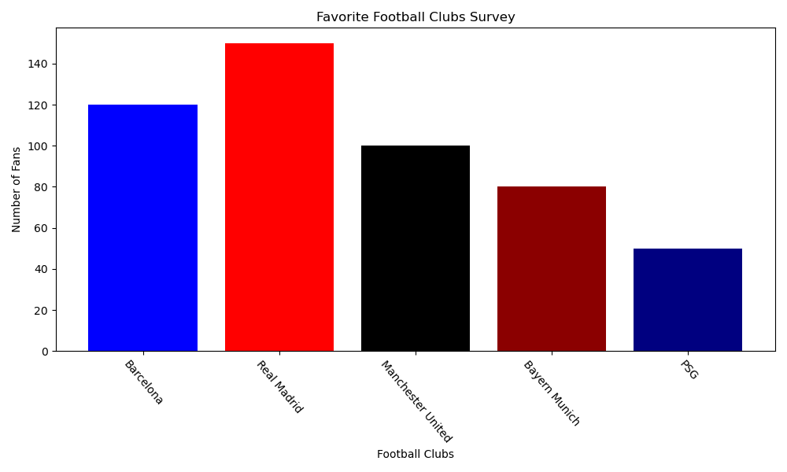

[bar chart code example (jupyter notebook)](../notebooks/02.%20Descriptive%20statistics.ipynb)

🔹 *Relative Frequency: Instead of raw counts, we can express data as a percentage:*
*Relative Frequency = $\frac{\text{Frequency}}{\text{Total Count}} \times 100$*

| Club               | Frequency | Relative Frequency (%) |
|--------------------|-----------|------------------------|
| Barcelona          | 120       | 24%                    |
| Real Madrid        | 150       | 30%                    |
| Manchester United  | 100       | 20%                    |
| Bayern Munich      | 80        | 16%                    |
| PSG                | 50        | 10%                    |

*Here is a pie chart representation of the relative frequency:*

[pie chart code example (jupyter notebook)](../notebooks/02.%20Descriptive%20statistics.ipynb)

🔹 *Cumulative Frequency:*
*Cumulative frequency shows the running total of frequencies.*

| Club               | Frequency | Cumulative Frequency |
|--------------------|-----------|----------------------|
| Barcelona          | 120       | 120                  |
| Real Madrid        | 150       | 270                  |
| Manchester United  | 100       | 370                  |
| Bayern Munich      | 80        | 450                  |
| PSG                | 50        | 500                  |

*Here is a line chart representation of the cumulative frequency:*
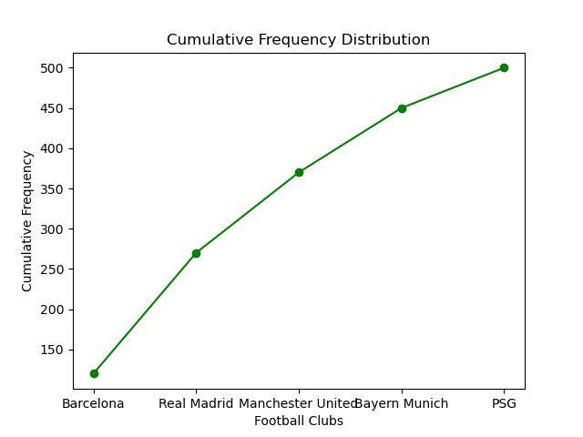

[Line chart code example (jupyter notebook)](../notebooks/02.%20Descriptive%20statistics.ipynb)

#### b) Numerical Data Visualization

📌 *Introduction*

*Numerical data consists of values that are measurable and continuous rather than categorical. Instead of distinct groups, numerical data can take on a wide range of values, making visualization crucial to understand patterns, distributions, and trends.*

📌 *Example: In the Titanic dataset (available in seaborn), the "Age" column represents numerical data. Since age values aren’t categorical, we must group them into bins (intervals) to analyze their distribution.*

📌 *Histogram*

*A Histogram is a visualization used for numerical data where we create bins (or buckets) to group similar values.*
🔹 *It’s similar to a bar chart, but instead of distinct categories, the bars represent continuous intervals of data.*
🔹 *In a histogram, the bars are connected because the data is continuous.*

📌 *Why Do We Need Bins in a Histogram?*

*Instead of counting exact numbers (e.g., Age = 18, Age = 19, etc.), we group ages into ranges (e.g., 0-10, 11-20, etc.).*
*The bin size affects how detailed or summarized the histogram appears:*
    *Too many bins → Overly detailed, hard to interpret.*
    *Too few bins → Oversimplified, may miss important patterns.*

📌 *Example: Titanic Dataset (Age Distribution Histogram)*

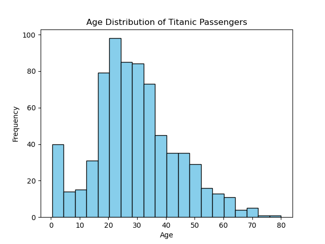

[code example (jupyter notebook)](../notebooks/02.%20Descriptive%20statistics.ipynb)

📌 *Types of Histograms*

1️⃣ *Symmetric Histogram (Bell-Shaped/Normal Distribution)*  
🔹 *Data is evenly distributed around the center.*  
🔹 *Example: Heights of people in a large population.*

2️⃣ *Bimodal Histogram*  
🔹 *Has two peaks, indicating two dominant groups in the dataset.*  
🔹 *Example: Exam scores where two groups perform very differently (e.g., experts vs. beginners).*

3️⃣ *Left-Skewed Histogram (Negatively Skewed)*  
🔹 *Long left tail (more values are concentrated on the right).*  
🔹 *Example: Age at retirement (most retire at 60+, few at younger ages).*

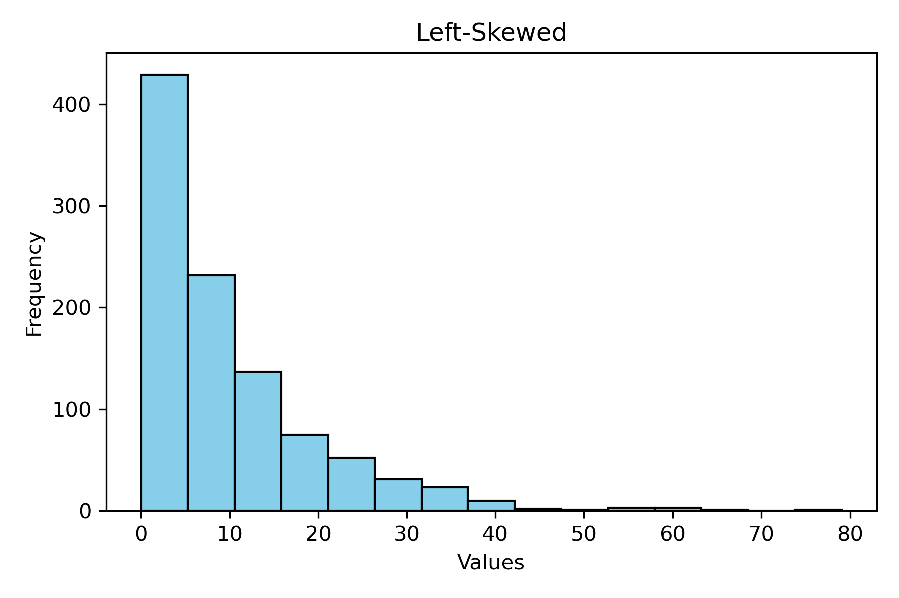

4️⃣ *Right-Skewed Histogram (Positively Skewed)*  
🔹 *Long right tail (more values are concentrated on the left).*  
🔹 *Example: Income distribution (few people earn extremely high salaries).*

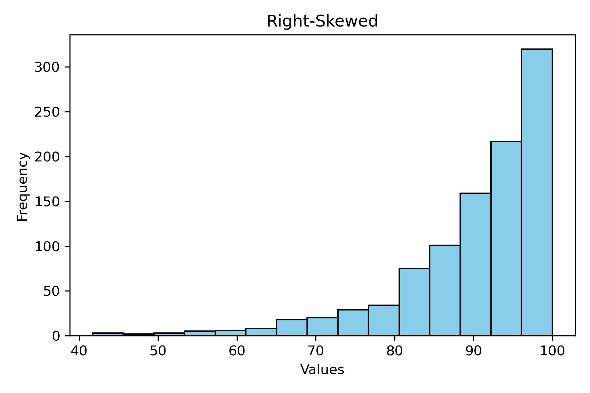

5️⃣ *Uniform Histogram*  
🔹 *All bins have roughly equal frequency (no clear pattern).*  
🔹 *Example: Rolling a fair die multiple times.*

6️⃣ *No Clear Pattern*  
🔹 *Data doesn’t follow any specific shape, indicating randomness or mixed distributions.*

### ii) Graphs for Bivariate Analysis

*Bivariate analysis involves two variables and helps us understand their relationship. It can be categorized into three types based on the nature of the variables:*

1️⃣ *Categorical - Categorical* 🏷️📊  
2️⃣ *Numerical - Numerical* 🔢📉  
3️⃣ *Categorical - Numerical* 🏷️🔢  

#### a) Categorical - Categorical Variables

*When both variables are categorical, we analyze how one category is related to another.*

📌 *Contingency Table (Cross Tabulation)*

🔹 *A contingency table (cross-tabulation table) is used to summarize the frequency distribution of two categorical variables.*  
🔹 *It helps us count occurrences and see how categories interact.*  

📌 *Example: Titanic Dataset*

*Consider the Titanic dataset, where we analyze:*

📌 *Survival status ("survived") vs. Passenger class ("class")*

🚢 *Question: Does survival depend on passenger class?*

📌 *Jupyter Notebook Code: [Creating a Contingency Table](../notebooks/02.%20Descriptive%20statistics.ipynb)*

📌 *Interpreting the table:*

- *Rows represent passenger class (First, Second, Third).*  
- *Columns represent survival status (0 = Not survived, 1 = Survived).*  
- *Each cell shows the count of passengers in that class who survived or not.*

*Now that we have a contingency table, we can plot a grouped bar chart to visualize the relationship between the two categorical variables.*

*📌 Jupyter Notebook Code: [Grouped Bar Chart using Seaborn](../notebooks/02.%20Descriptive%20statistics.ipynb)*

#### b) Numerical - Numerical Variables

*When both variables are numerical, we analyze how they relate to each other. This helps in identifying patterns, trends, and correlations between two continuous variables.*

📌 *Common Plots for Numerical-Numerical Analysis*

📌 *1️⃣ Scatter Plot – Used to visualize the relationship between two numerical variables.*  
📌 *2️⃣ Line Plot – Used when one variable (like time) is continuous.*  
📌 *3️⃣ Heatmap (Correlation Matrix) – Shows correlation values between multiple numerical features.*  

📌 *Scatter Plot*

🔹 *Best for identifying relationships, trends, and outliers.*  
🔹 *Helps check linear, non-linear, or no correlation between variables.*

*Example: Titanic Dataset*

*Let’s analyze the relationship between age and fare (how age affects ticket price).*

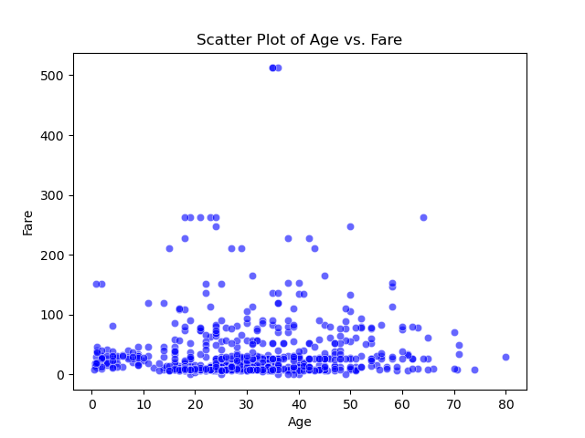

📌 *Insights from Scatter Plot*

✅ *Identifies patterns (e.g., do older people pay more?).*  
✅ *Reveals outliers (e.g., extremely high fares).*  
✅ *Helps decide if further statistical analysis is needed.*  

📌 *Jupyter Notebook Code: [Scatter Plot](../notebooks/02.%20Descriptive%20statistics.ipynb).*

#### c) Categorical - Numerical Analysis

*When analyzing a categorical variable (e.g., "Gender", "Class") with a numerical variable (e.g., "Age", "Fare"), we look at how the numerical data is distributed across different categories. Unlike categorical-categorical relationships (which are based on counts), here, we perform aggregations on the numerical column (e.g., Mean, Median, Sum, etc.).*

📌 *Key Visualization Techniques*

✅ *Bar Chart with Aggregation → Average, Sum, or Median of a numerical variable grouped by a categorical column.*  
✅ *Box Plot → Shows the distribution (min, max, quartiles, median, and outliers) of a numerical variable for each category.*  
✅ *Violin Plot → A more detailed version of the box plot, showing the density distribution.*  
✅ *Crosstab with Binning → Converts numerical values into bins and summarizes them across categories.*  

1️⃣ *Bar Chart (Aggregation on Numerical Column)*

🔹 *When the y-axis represents a numerical column, it must be aggregated (e.g., mean fare for each passenger class).*  

📌 *Example: Average Fare Paid by Passenger Class*

🔹 *The bar height represents the total fare paid by each class.*  
🔹 *We can change estimator=sum to estimator=mean for average fare per class.*  

📌 *Jupyter Notebook Code: [example code](../notebooks/02.%20Descriptive%20statistics.ipynb).*

2️⃣ *Crosstab with Binning (Numeric Breakdown into Buckets)*

🔹 *If a numerical variable is continuous (e.g., "Age"), we can convert it into bins (age groups) and analyze how it varies across categories.*

📌 *Example: Age Groups vs. Sex (How many passengers fall in each age group per gender?)*

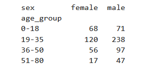

🔹 *Breaks "Age" into bins (e.g., 0-18, 19-35, etc.).*  
🔹 *Shows how many males and females fall into each age category.*  

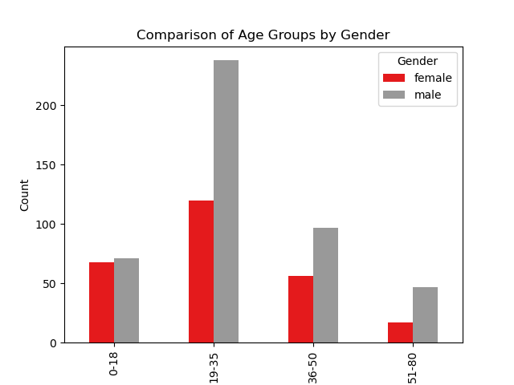

📌 *Jupyter Notebook Code: [example code](../notebooks/02.%20Descriptive%20statistics.ipynb).*

### 4. Five-Number Summary and Box Plot

*The Five-Number Summary is a fundamental concept in statistics that provides a concise overview of a dataset's distribution. However, before understanding it, we first need to learn about quantiles, as they form the basis of this summary.*

**📌 What are Quantiles?**

*Quantiles are statistical measures used to divide a dataset into equal-sized groups, where each group contains an equal number of observations. These divisions help in understanding data distribution, summarizing datasets, and detecting outliers.*

*Quantiles are a general term that includes measures like quartiles, percentiles, and deciles, which divide data into different numbers of equal parts.*

**🔹 Why Are Quantiles Important?**

*✅ Understanding Data Distribution – Helps analyze how values are spread across a dataset.*

*✅ Summarizing & Comparing Datasets – Allows quick comparisons between different datasets.*

*✅ Identifying Outliers – Extreme values can be detected using quantile-based techniques like the Interquartile Range (IQR).*

**📌 Why Do We Need to Divide Data into Parts?**

*Dividing data into parts using quantiles (like quartiles, percentiles, or deciles) helps us analyze, interpret, and compare datasets more effectively. Here are the key reasons:*

**🔹 1. Understand Data Distribution**

- *If we divide the data into equal parts, we can see how values are spread.*  
- *Helps us identify whether data is skewed (left/right) or symmetrically distributed.*  
- *Example: In a salary dataset, knowing that the top 25% earn significantly more than the rest reveals income inequality.*  

**🔹 2. Summarize Large Datasets Efficiently**

- *Instead of analyzing every individual value, we can use quantiles to get a quick summary.*
- *Example: Instead of looking at 10,000 student scores, just knowing the 25th, 50th (median), and 75th percentiles gives a good idea of performance.*

**🔹 3. Compare Different Datasets Easily**

- *Helps compare two datasets even if they have different scales or units.*
- *Example: Comparing the top 10% performers in two schools instead of comparing all students one by one.*

**🔹 4. Detect Outliers (Unusual Data Points)**

- *Extreme values (outliers) can distort statistics like the mean.*
- *Quantiles help identify what is "normal" and what is an anomaly.*
- *Example: If most house prices are between $200K–$500K, but one is $5 million, quantiles can flag this as an outlier.*

**🔹 5. Useful for Decision-Making in Machine Learning & Data Science**

- *Helps in feature engineering (e.g., binning continuous data into categories).*
- *Useful in data preprocessing, like removing extreme outliers or transforming skewed data.*
- *Example: In credit risk modeling, knowing the risk percentile of an applicant's credit score is more useful than just the score itself.*

**🔹 Example: Why Mean Alone is Not Enough?**

*Imagine two datasets:*
*Dataset A: [10, 20, 30, 40, 50]*
*Dataset B: [1, 10, 30, 50, 100]*

- *Both have the same mean (30), but their distributions are very different!*
- *Dataset B has more extreme values (outliers), which the mean cannot capture.*
- *Using quantiles (like median and IQR) gives a better picture of variability in the data.*

***📌 Conclusion: Dividing data into parts using quantiles makes it easier to interpret, compare, and work with, especially in real-world applications like ML, finance, and healthcare.*** 🚀

**📌 Types of Quantiles**

*Quantiles are used to divide a dataset into equal parts to understand its distribution. The most commonly used types are quartiles, deciles, percentiles, and quintiles.*

#### a) Quartiles (Q1, Q2, Q3) → 4 Equal Parts

*Quartiles divide the data into four equal parts, each containing 25% of the data.*

*Q1 (First Quartile) → 25th percentile (25% of the data is below Q1).*  
*Q2 (Second Quartile or Median) → 50th percentile (Divides the data in half).*  
*Q3 (Third Quartile) → 75th percentile (75% of the data is below Q3).*  

**📌 Example:**
*Consider the dataset: [5, 10, 15, 20, 25, 30, 35]*

*Q1 (25th percentile) = 12.5*  
*Q2 (Median / 50th percentile) = 20*  
*Q3 (75th percentile) = 27.5*  

#### b) Deciles → 10 Equal Parts

*Deciles divide data into 10 equal parts, each containing 10% of the data.*

*D1 (10th percentile)*  
*D2 (20th percentile)*  
*...*  
*D9 (90th percentile)*  

**📌 Example:**
*If students' test scores are ranked using deciles, those in the top 10% (D9 and above) are high performers, while those in D1 are in the lowest 10%.*

#### c) Percentiles → 100 Equal Parts

*Percentiles divide data into 100 equal parts and are widely used in statistics.*

*P1 (1st percentile) → 1% of data falls below this.*  
*P50 (50th percentile / Median)*  
*P90 (90th percentile) → 90% of data is below this.*  

**📌 Example:**
*If you take a standardized test (e.g., SAT, GRE), a P90 score means you performed better than 90% of test-takers.*

#### d) Quintiles → 5 Equal Parts

*Quintiles divide data into 5 equal parts, with each part containing 20% of the data.*

*Q1 (20th percentile)*  
*Q2 (40th percentile)*  
*Q3 (60th percentile)*  
*Q4 (80th percentile)*  

**📌 Example:**
*In income distribution studies, quintiles help group people based on earnings.*

*The first quintile (lowest 20%) represents the poorest.*  
*The fifth quintile (top 20%) represents the richest.*  

**📌 Why Do We Use These?**

*Different quantiles provide different levels of granularity to analyze data.*

*Quartiles are widely used in box plots and IQR (outlier detection).*  
*Deciles and Percentiles help in ranking and scoring (e.g., test scores, income distribution).*  
*Quintiles are useful in economic and financial analysis.*  

**📌 Conclusion: Quantiles help summarize, compare, and analyze data distributions effectively!** 🚀

#### Things to Remember While Calculating Quantiles

**1️⃣ Data Should Be Sorted from Low to High – Why?**

*Quantiles divide data into equal parts, which requires knowing the relative position of values. Sorting ensures that:*  
*We correctly locate the values at specific percentiles (e.g., 25th, 50th, 75th).*  
*The calculations are consistent and meaningful across datasets.*

**📌 Example:**  
*Unsorted Data → [20, 5, 35, 10, 25, 15, 30]*  
*Sorted Data → [5, 10, 15, 20, 25, 30, 35] (Now we can find Q1, Q2, Q3 properly).*

**2️⃣ You Are Basically Finding the Location of an Observation (Meaning?)**

*Quantiles do not always correspond to actual data points but instead indicate a position in the sorted dataset.*  
*If the location is an exact index, take that value.*  
*If the location is between two indexes, take the average of the two nearest values.*

**📌 Example:**  
*For 25th percentile in [10, 20, 30, 40],*  
*The location is (25/100) × 4 = 1st index → Q1 = 10.*

*For [10, 15, 20, 25],*  
*The location is (25/100) × 4 = 1.25, so we interpolate between 1st & 2nd values.*

**3️⃣ They Are Not Actual Values in the Data. Why? Then How to Interpret?**

*Quantiles are mathematical divisions of data, so their values may not exist in the dataset. Instead, they represent a point in the distribution.*

**📌 Example:**  
*Dataset: [5, 10, 15, 20, 25]*  
*Q1 (25th percentile) = 7.5, but 7.5 is not in the dataset.*  
*Interpretation: 25% of data is below 7.5 and 75% is above.*

**🔹 How to Interpret?**  
*If Q3 = 30, it means 75% of data points are ≤ 30.*  
*If P90 = 85, it means 90% of observations are ≤ 85.*

**4️⃣ All Other ‘Tiles’ Can Be Easily Derived from Percentiles**

*Since percentiles divide data into 100 equal parts, other quantiles are just multiples of percentiles:*  
*Quartiles (Q1, Q2, Q3) → P25, P50, P75.*  
*Deciles (D1, D2, ..., D9) → P10, P20, ..., P90.*  
*Quintiles (Q1, Q2, ..., Q4) → P20, P40, P60, P80.*

**📌 Example:**  
*If you have a percentile function, you can compute any quartile, decile, or quintile without separate calculations!* 🚀

**Percentage vs. Percentile – Understanding the Difference**

**✅ Percentage (90%)**

  - *A percentage represents a score relative to a total.*  
  - *If you score 90% on a test, it means you got 90 out of 100 marks.*  
  - *It is an absolute measure of performance.*  

**✅ Percentile (90th Percentile)**

  - *A percentile represents your relative standing in a dataset.*  
  - *If you are in the 90th percentile, it means 90% of people scored below you, and 10% scored above you.*  
  - *It is a ranking measure, not an absolute score.*  

**📌 Example: Test Scores Comparison**

| Student | Score (Out of 100) | Percentage | Percentile |
|---------|---------------------|------------|------------|
| *A*     | *85*                | *85%*      | *90th*     |
| *B*     | *70*                | *70%*      | *60th*     |
| *C*     | *55*                | *55%*      | *30th*     |

**🧐 Interpretation:**

  - *Student A scored 85%, but since most students scored lower, they are in the 90th percentile (better than 90% of students).*  
  - *Student B scored 70%, meaning they performed better than 60% of students.*  
  - *Student C scored 55%, meaning they performed better than 30% of students.*  

**🚀 Key Takeaway:**

  - *Percentage tells how much you scored.*  
  - *Percentile tells how you performed relative to others.*  

**📌 Formula for Calculating Percentile**

*Different tools use slightly different formulas for calculating percentiles. Below are the common formulas and variations used in statistics and programming libraries.*  

#### 1️⃣ Common Percentile Formula (for Understanding)

**Calculating the p-th Percentile (Pₚ)**

*To find the p-th percentile (Pₚ) in a dataset sorted in ascending order:*

$$
P_p = X \left( p \times \frac{100}{n+1} \right)
$$

*or equivalently,*

$$
P_p = X \left( \frac{100 \cdot p}{n+1} \right)
$$

*where:*  
  - *p = desired percentile (e.g., 90 for the 90th percentile)*  
  - *n = number of values in the dataset*  
  - *X = sorted dataset*  
  - *If the index is not an integer, we interpolate between the closest values.*  

**2️⃣ Different Percentile Calculation Methods in Tools**

- *Tool*    *Formula Used*
  - *Excel* =PERCENTILE.EXC(data, p/100) (Exclusive) or =PERCENTILE.INC(data, p/100) (Inclusive)  
  - *NumPy* Uses linear interpolation by default: numpy.percentile(data, p, interpolation='linear')  
  - *Pandas*    Similar to NumPy, uses pandas.Series.quantile(q=p/100)  
  - *SciPy* scipy.stats.percentileofscore(data, value, kind='rank') (For percentile of a value)  

**📌 Example: Manually Calculating the 75th Percentile**

*Dataset: [5, 10, 15, 20, 25, 30, 35, 40, 45]*  

  - *Sort the data → [5, 10, 15, 20, 25, 30, 35, 40, 45]*  
  - *Find the position:*  
    *P75=(75100×(9+1))=7.5*  
    *P75​=(10075​×(9+1))=7.5*  
  - *Interpolate:*  
    - *7th value = 35, 8th value = 40*  
    - *Interpolation: 35 + 0.5 × (40 - 35) = 37.5*  
    - *75th percentile = 37.5*  

*📌 Python Code to Calculate Percentile [click here](../notebooks/02.%20Descriptive%20statistics.ipynb)*

**📌 Finding the Percentile Rank of a Given Value**

*Instead of finding the percentile value, we might need to find the percentile rank of a specific value in the dataset.*  

**Formula:**
$$
P = \left(\frac{\text{Number of values below } X}{\text{Total values}}\right) \times 100
$$

*Example in Python: [click here](../notebooks/02.%20Descriptive%20statistics.ipynb)*

**🚀 Key Takeaways**

  - *Different tools use different formulas (inclusive/exclusive methods).*  
  - *Interpolation is used if the exact index doesn’t exist in the dataset.*  
  - *NumPy & Pandas make it easy to calculate percentiles in Python.*  
  - *Percentile rank helps understand where a value stands in the dataset.*  

**📌 Why Do We Use $\frac{p}{100}(n+1)$ Instead of $\frac{p}{100}n$ in the Percentile Formula?**

*The formula for calculating the p-th percentile is:*  

$$
P_p = X\left(\frac{p}{100} \times (n+1)\right)
$$

*where \( n \) is the number of observations.*

*But why do we use \( n+1 \) instead of just \( n \)?* 🤔

**🔹 1. Intuition: Why Add 1?**

*Imagine a continuous distribution (like a probability curve) instead of a discrete dataset. In a continuous system, percentiles do not correspond to actual data points but rather positions between them.*

*Using \( n+1 \) extends the range slightly, allowing us to estimate percentiles as if the dataset were continuous rather than just a set of points.*

**📌 Example:**

  - *Suppose we have 4 values: [10, 20, 30, 40]*
  - *To find the 75th percentile, we compute:*  

    $$
    P_{75} = \left(\frac{75}{100} \times (4+1)\right) = \left(\frac{75}{100} \times 5\right) = 3.75
    $$

  - *The position is 3.75, meaning the 75th percentile is between the 3rd (30) and 4th (40) values.*
  - *Instead of picking a data point, we interpolate between 30 and 40.*

*Without \( n+1 \), the position would be 3.0, giving an exact data point instead of an estimate.*

**🔹 2. It Works Better for Small Datasets**

*For small datasets, if we use just \( n \), percentiles might not be well-distributed across the data. Using \( n+1 \) ensures the percentiles are spaced appropriately.*

*Consider a dataset of only two values: [5, 10].*

 - *If we want the 50th percentile, using \( n \):*  
    $$
    P_{50} = \left(\frac{50}{100} \times 2\right) = 1
    $$

  - *This directly picks the first value (5), which is not representative of the middle of the data.*

  - *But using \( n+1 \):*  
    $$
    P_{50} = \left(\frac{50}{100} \times 3\right) = 1.5
    $$

  - *This interpolates between the first (5) and second (10) values, giving a more accurate middle value:*  
    $$
    5 + 0.5 \times (10 - 5) = 7.5
    $$

*7.5 is a better estimate of the median than just picking 5.*

**🔹 3. Aligns with Theoretical Continuous Distributions**

  - *Real-world data often follows continuous distributions (like the normal distribution).*
  - *The "n+1" approach approximates the underlying continuous function, which is why it’s commonly used in interpolation-based methods.*

**🔹 4. Why Some Tools Use Only \( n \)?**

*Some software (like Excel’s PERCENTILE.INC()) uses:*  
$$
P_p = X\left(\frac{p}{100} \times n\right)
$$

*This method only picks actual data points rather than interpolating between them. It’s useful when we want an exact value from our dataset, but it can sometimes give less accurate estimates for percentiles.*

**📌 Summary**

  - *Using \( n+1 \) accounts for interpolation, treating data as continuous.*
  - *It gives better estimates for small datasets.*
  - *It aligns with statistical probability distributions.*
  - *Different tools may use different formulas based on whether they interpolate.*  

*🚀 Want to See the Difference in Python? [click here](../notebooks/02.%20Descriptive%20statistics.ipynb)*

### five-Number Summary

*The 5-number summary is a simple yet powerful way to describe a dataset's distribution. It consists of:*  

1️⃣ *Minimum (Min) → Smallest value in the dataset.*  
2️⃣ *First Quartile (Q1 or 25th Percentile) → Median of the lower half.*  
3️⃣ *Median (Q2 or 50th Percentile) → Middle value of the dataset.*  
4️⃣ *Third Quartile (Q3 or 75th Percentile) → Median of the upper half.*  
5️⃣ *Maximum (Max) → Largest value in the dataset.*  

**📌 Example Dataset**

**🔹 Suppose we have the dataset:**
*[2, 5, 7, 10, 15, 18, 21, 25, 30, 35]*  

**Step-by-Step Calculation:**

- *Min = 2 (smallest value)*  
- *Q1 (25th percentile) = (5 + 7) / 2 = 6*  
- *Median (Q2 or 50th percentile) = (10 + 15) / 2 = 12.5*  
- *Q3 (75th percentile) = (21 + 25) / 2 = 23*  
- *Max = 35 (largest value)*  

**✅ Final 5-Number Summary:**
*[2, 6, 12.5, 23, 35]*  

**📌 Why Is This Useful?**

  - *Helps understand the spread and distribution of data.*  
  - *Identifies skewness—if Q2 is closer to Q1 or Q3, the data is skewed.*  
  - *Used in Box Plots for visualizing distributions.*  

#### Box Plot

*A box plot (also called a box-and-whisker plot) is a graphical representation of the distribution of numerical data using quartiles. It provides insights into spread, skewness, and outliers in the dataset.*

**🔹 Why Do We Use Box Plots?**

  - *Easily visualize the distribution of numerical data.*  
  - *Identify outliers in the dataset.*  
  - *Compare multiple distributions efficiently.*  
  - *Understand the spread of data and detect skewness.*  

**📌 Step-by-Step Construction of a Box Plot with an Example**

**🔹 Given Dataset (Including Outlier)**
*[2, 5, 7, 10, 15, 18, 21, 25, 30, 35, 100]*  

*Here, 100 is an outlier because it is much larger than the rest of the values.*

**📌 Step 1️⃣: Sort the Data in Ascending Order**
*[2, 5, 7, 10, 15, 18, 21, 25, 30, 35, 100]*  

*Sorting is crucial for correctly finding quartiles and whiskers.*

**📌 Step 2️⃣: Compute Q1, Q2 (Median), and Q3**

  - *Q1 (First Quartile - 25th Percentile) → Median of the lower half:*  
    *Lower half: [2, 5, 7, 10, 15]*  
    *Q1 = 7*

  - *Q2 (Median - 50th Percentile) → Middle value:*  
    *Q2 = 15*

  - *Q3 (Third Quartile - 75th Percentile) → Median of the upper half:*  
    *Upper half: [18, 21, 25, 30, 35]*  
    *Q3 = 25*

**✅ Quartiles: [Q1 = 7, Median = 15, Q3 = 25]**

**📌 Step 3️⃣: Compute the Interquartile Range (IQR)**  
$$
\text{IQR} = Q3 - Q1 = 25 - 7 = 18
$$  

*IQR helps define the range for normal data and identify outliers.*

**📌 Step 4️⃣: Compute Whiskers (Min & Max in Box Plot)**

*Whiskers define the range of data excluding outliers.*

  - *Lower Whisker (Minimum in Box Plot):*  
    $$
    \text{Min} = Q1 - 1.5 \times \text{IQR} = 7 - (1.5 \times 18) = 7 - 27 = -20
    $$  
    *Since -20 is not in the dataset, we take the smallest actual value:*  
    **✅ Min (Whisker) = 2**

  - *Upper Whisker (Maximum in Box Plot):*  
    $$
    \text{Max} = Q3 + 1.5 \times \text{IQR} = 25 + (1.5 \times 18) = 25 + 27 = 52
    $$  
    *Since 100 > 52, it is an outlier.*  
    **✅ Max (Whisker) = 35 (largest value within whisker range).**

**📌 Step 5️⃣: Identify Outliers**
  - *Outliers are values beyond whisker limits.*
  - *Any value below -20 or above 52 is an outlier.*
  - *Here, 100 is an outlier.*

**✅ Final Box Plot Values:**

  - *Min (Whisker) = 2*
  - *Q1 = 7*
  - *Median (Q2) = 15*
  - *Q3 = 25*
  - *Max (Whisker) = 35*
  - *Outlier = 100*

**📌 Step 6️⃣: Plot Box Plot Using Python** *[click here](../notebooks/02.%20Descriptive%20statistics.ipynb)*

**📌 Step 7️⃣: Interpreting the Box Plot**

  - *The box represents the interquartile range (Q1 to Q3).*  
  - *The median (Q2) is shown inside the box.*  
  - *Whiskers extend from Q1 and Q3 to the minimum and maximum values (excluding outliers).*  
  - *The outlier (100) is shown as a separate dot.*  

**📌 Side-by-Side Box Plot: Dataset & Python Code**

**📌 Suitable Dataset (Comparing Three Groups)**

*Let's compare test scores of students from three different classes:*

| Class A | Class B | Class C |
|---------|---------|---------|
| 55      | 60      | 65      |
| 58      | 62      | 67      |
| 60      | 64      | 70      |
| 65      | 66      | 75      |
| 68      | 68      | 80      |
| 70      | 70      | 85      |
| 75      | 74      | 90      |
| 80      | 78      | 95      |
| 85      | 85      | 100     |
| 95      | 95      | 110 (Outlier) 

**📌 Python Code to Create Side-by-Side Box Plot** *[click here](../notebooks/02.%20Descriptive%20statistics.ipynb)* 

**📌 Benefits of Side-by-Side Box Plots**

  - *Compare Multiple Datasets → Easily compare distributions across different groups.*  
  - *Detect Outliers in Each Group → Identify extreme values for each category.*  
  - *Analyze Spread and Variation → Check which group has more variability.*  
  - *Check for Skewness → See if data is symmetrically distributed or skewed.*  
  - *Identify Overlapping Distributions → Understand differences and similarities between groups.*  

**✅ From the plot:**

  - *Class C has an outlier (110), which is significantly higher.*  
  - *Class A and Class B have similar distributions, but Class A has slightly higher variability.*  
  - *Class C has a higher median than the other two classes.*  

### 5. Covariance and Correlation

#### a) Covariance: Understanding the Relationship Between Two Variables

**🔹 Why Does Covariance Exist? What Problem Does It Solve?**

*Before discussing covariance, let's understand why we need it.*

**📌 Suppose we have two numerical variables, height and weight.**

  - *We want to study their relationship:*
    - *Do taller people tend to weigh more?*  
    - *If height increases, does weight also increase?*  
    - *If one decreases, does the other decrease?*  

**✅ The Problem:**

  - *Mean, median, and standard deviation tell us about a single variable, but they don’t show relationships between two variables.*
  - *Covariance solves this! It quantifies how two variables change together.*

**🔹 What Is Covariance?**

*Covariance is a statistical measure that describes the degree to which two variables are linearly related.*

**📌 Key Insights:**

  - *If both variables increase together, covariance is positive 📈.*
  - *If one variable increases while the other decreases, covariance is negative 📉.*
  - *If covariance = 0, the variables have no linear relationship (but they might still have a non-linear relationship).*

**🔹 Covariance Interpretation**

| Covariance Value       | Interpretation                                    |
|------------------------|---------------------------------------------------|
| Positive Covariance (> 0) | Both variables move in the same direction (e.g., height and weight). |
| Negative Covariance (< 0) | One variable increases while the other decreases (e.g., price and demand). |
| Zero Covariance (= 0)     | No linear relationship between variables.      |

**📌 Example Scenarios:**

  - *Positive Covariance: Higher study hours → Higher exam scores.*
  - *Negative Covariance: Higher product price → Lower sales.*
  - *Zero Covariance: Shoe size and intelligence have no relationship.*

**🔹 Covariance Formula**

Covariance is calculated using the following formulas:

**📌 Population Covariance Formula**

$$
\text{Cov}(X, Y) = \frac{\sum (X_i - \mu_X)(Y_i - \mu_Y)}{N}
$$

**Where:**

- \( (X, Y) \) = Two numerical variables  
- \( (\mu_X, \mu_Y) \) = Mean of \( X \) and \( Y \)  
- \( N \) = Population size  

**📌 Sample Covariance Formula**

$$
\text{Cov}(X, Y) = \frac{\sum (X_i - \bar{X})(Y_i - \bar{Y})}{n - 1}
$$

**Where:**

- \( (\bar{X}, \bar{Y}) \) = Sample means  
- \( n \) = Sample size  
  
**📌 Why \( n - 1 \) instead of \( N \) in the sample formula?**

  - *In sample statistics, we divide by \( n - 1 \) to make it an unbiased estimator of the population covariance.*

**🔹 Step-by-Step Example (Manual Calculation)**

**📌 Consider a dataset of students' study hours and their exam scores:**

| Study Hours (X) | Exam Score (Y) |
|------------------|----------------|
| 2                | 50             |
| 4                | 60             |
| 6                | 70             |
| 8                | 80             |
| 10               | 90             |
**Step 1: Calculate Mean of X and Y**
$$
\bar{X} = \frac{2 + 4 + 6 + 8 + 10}{5} = 6
$$
$$
\bar{Y} = \frac{50 + 60 + 70 + 80 + 90}{5} = 70
$$

**Step 2: Compute \( (X_i - \bar{X}) \) and \( (Y_i - \bar{Y}) \)**

| X  | \( X_i - \bar{X} \) | Y   | \( Y_i - \bar{Y} \) | \( (X_i - \bar{X})(Y_i - \bar{Y}) \) |
|----|----------------------|-----|---------------------|-------------------------------------|
| 2  | -4                   | 50  | -20                 | 80                                  |
| 4  | -2                   | 60  | -10                 | 20                                  |
| 6  | 0                    | 70  | 0                   | 0                                   |
| 8  | 2                    | 80  | 10                  | 20                                  |
| 10 | 4                    | 90  | 20                  | 80                                  |

**Step 3: Sum Up the Products**
$$
\sum (X_i - \bar{X})(Y_i - \bar{Y}) = 80 + 20 + 0 + 20 + 80 = 200
$$

**Step 4: Apply the Formula**

*For population covariance:*
$$
\text{Cov}(X, Y) = \frac{200}{5} = 40
$$

*For sample covariance:*
$$
\text{Cov}(X, Y) = \frac{200}{5 - 1} = \frac{200}{4} = 50
$$

**📌 Interpretation:**

  - *Since covariance is positive, study hours and exam scores increase together.*
  - *A student who studies more tends to score higher on the exam.*

**✅ Summary of Covariance**

  - *Measures the relationship between two variables (linear association).*
  - *Positive covariance → both variables increase together.*
  - *Negative covariance → one increases, the other decreases.*
  - *Covariance = 0 → No linear relationship.*
  - *Sample vs. Population formulas differ in denominator (\( n - 1 \) for sample).*

**📌 Limitations of Covariance**

*While covariance tells us the direction of the relationship between two variables, it does not tell us the strength of the relationship.*

**✅ Key Limitation:**

  - *The magnitude of covariance depends on the scale of the variables, meaning that changing the units of measurement can change the covariance.*
  - *If we double both \( X \) and \( Y \), the covariance will increase by a factor of 4 but the relationship remains the same.*

**📌 Example: Covariance Scaling Issue**

*Let’s take a dataset and compute covariance before and after scaling.*

| X (Hours Studied) | Y (Exam Score) |
|-------------------|-----------------|
| 2                 | 50              |
| 4                 | 60              |
| 6                 | 70              |
| 8                 | 80              |
| 10                | 90              |

**Step 1: Compute Covariance for Original Dataset**

*Now, let’s double both \( X \) and \( Y \):*

| 2X (Doubled Study Hours) | 2Y (Doubled Scores) |
|--------------------------|----------------------|
| 4                        | 100                  |
| 8                        | 120                  |
| 12                       | 140                  |
| 16                       | 160                  |
| 20                       | 180                  |

**Step 2: Compute Covariance Again**

  - *The covariance will quadruple (increase by \( 2^2 = 4 \)).*  
  - *But the relationship between the variables is still the same!* 

**📌 Conclusion**

**✅ Covariance depends on the scale of variables, meaning:**

  - *If we double \( X \) and \( Y \), covariance increases by 4×, even though the relationship remains the same.*  
  - *This makes it hard to compare relationships across datasets with different units.*  

**📌 Solution?**
*To remove scale dependency, we use Correlation*

*jupyter notebook code : [click here](../notebooks/02.%20Descriptive%20statistics.ipynb)*  

#### b) Correlation: Solving Covariance's Limitation

*While covariance tells us the direction of the relationship, it does not quantify its strength due to its dependence on scale.*

**👉 Solution?** *Use correlation, which standardizes covariance, making it scale-independent and easy to interpret.*

**📌 What is Correlation?**

  - *Correlation quantifies the strength and direction of a linear relationship between two variables.*  
  - *Measured using the correlation coefficient (\( r \)), which ranges from -1 to 1:*  
    - *\( r = +1 \) → Perfect positive correlation (as \( X \) increases, \( Y \) increases proportionally).*  
    - *\( r = -1 \) → Perfect negative correlation (as \( X \) increases, \( Y \) decreases proportionally).*  
    - *\( r = 0 \) → No correlation ( \( X \) and \( Y \) are not linearly related).*  
    - *Closer to ±1 → Stronger Relationship*  
    - *Closer to 0 → Weaker Relationship*  

**📌 Formula for Correlation Coefficient (\( r \))**
$$
r = \frac{\text{Cov}(X, Y)}{\sigma_X \cdot \sigma_Y}
$$

*where:*

  - *\(\text{Cov}(X, Y)\) = Covariance of \(X\) and \(Y\)*  
  - *\(\sigma_X\) = Standard deviation of \(X\)*  
  - *\(\sigma_Y\) = Standard deviation of \(Y\)*  

**👉 Since correlation divides covariance by the standard deviations, it removes the effect of scale!**

**📌 Example Dataset (Same as Before)**

| X (Hours Studied) | Y (Exam Score) |
|-------------------|-----------------|
| 2                 | 50              |
| 4                 | 60              |
| 6                 | 70              |
| 8                 | 80              |
| 10                | 90              |

**1️⃣ Compute Correlation for Original Dataset**

**2️⃣ Double X and Y → Check Correlation Remains the Same**

**3️⃣ Compare \( X \) vs \( X \) (Perfect Correlation) and \( X \) vs \( Y \)**

**4️⃣ Plot 2 Side-by-Side Graphs:**

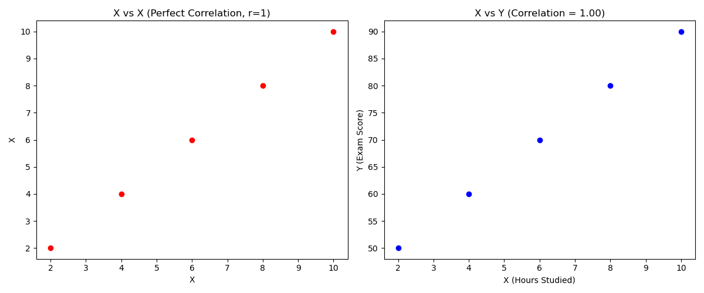

  - *\( X \) vs. \( X \) → Strongest Correlation ( \( r = 1 \) )*
  - *\( X \) vs. \( Y \) → High Positive Correlation*

**5️⃣ Plot Another 2 Side-by-Side Graphs to show that scaling does not affect correlation**

*jupyter notebook code : [click here](../notebooks/02.%20Descriptive%20statistics.ipynb)*

**📌 Conclusion**

**✅ Why is Correlation Better than Covariance?**

  - *It quantifies the strength of the relationship (weak vs strong).*  
  - *It is unitless → Not affected by the scale of data.*  
  - *Easier to compare relationships across datasets.*  

**📌 Final Takeaway:**

  - *Covariance only tells us direction but not strength.*  
  - *Correlation solves this by normalizing covariance, making it easier to interpret and compare!* 🚀

**📌 Correlation vs Causation: Understanding the Difference**

*A common mistake people make is assuming that correlation implies causation—just because two things are related doesn’t mean one causes the other!*

**📌 What is Correlation?**

  - *Definition: Correlation measures the strength and direction of a linear relationship between two variables.*  
  - *Example: Ice cream sales and drowning incidents are positively correlated—both increase in summer.*

    👉 *Does ice cream cause drowning?* ❌ *No!*  
    👉 *The real reason? Hot weather (a third factor) increases both ice cream sales and swimming activities, leading to more drownings.*

**📌 What is Causation?**

  - *Definition: Causation means that one variable directly influences the other.*  
  - *Example: More hours of study → Higher exam scores.*

    👉 *Here, studying directly improves exam scores, so it's causation.* ✅  

**📌 Why Correlation ≠ Causation?**

**1️⃣ Third Variable Problem (Hidden factor affects both variables)**

  - *Example: Ice cream sales 🍦 and drowning incidents 🚣‍♂️ (Both caused by summer 🌞).*

**2️⃣ Reverse Causality (A causes B, but people think B causes A)**

  - *Example: Does watching violent TV cause aggression, or do aggressive people prefer violent TV?*

**3️⃣ Pure Coincidence (Two unrelated things happen together)**

  - *Example: The number of pirates has decreased over time, while global warming has increased.*
    👉 *Does this mean fewer pirates cause climate change?* ❌ *Of course not!*

### 6. Graphs for Multivariate Analysis

**🔹 What is Multivariate Analysis?**

*Multivariate analysis is a statistical technique used to analyze more than two variables simultaneously to understand complex relationships.*

**👉 Why?**

  - *Uncovers hidden patterns.*  
  - *Helps in decision-making based on multiple factors.*  
  - *Improves predictive modeling.*  

**📌 A. 3D Scatter Plot**

**How Does It Help in Multivariate Analysis?**

*A scatter plot is normally used for two variables, but a 3D scatter plot allows us to visualize relationships among three numerical variables by adding depth.*

**📌 Example:**

*Suppose we have a dataset with:*

  - *Age (X-axis)*  
  - *Income (Y-axis)*  
  - *Spending Score (Z-axis)*

  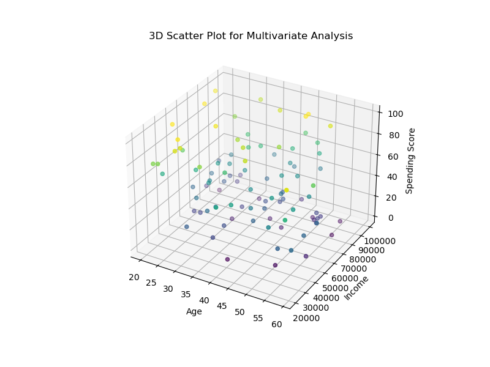

  *🔹 Jupyter Code for 3D Scatter Plot : [click here](../notebooks/02.%20Descriptive%20statistics.ipynb)*  

  **📌 Interpretation:**

  - *Helps visualize how three variables interact.*  
  - *Color mapping helps identify clusters or trends.*  

**📌 B. Hue Parameter in Seaborn**

**How Does It Help?**

  - *The hue parameter in Seaborn allows us to add a categorical variable to a 2D plot using color, making it a multivariate visualization.*

**🔹 Example:**

  - *X-axis: Age*  
  - *Y-axis: Income*  
  - *Hue (Color Coding): Gender*

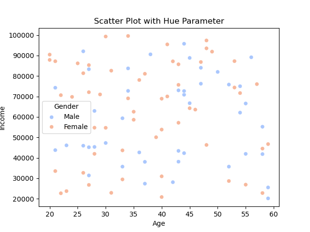

*🔹 Jupyter Code:[click here](../notebooks/02.%20Descriptive%20statistics.ipynb)*  

📌 Interpretation:

- *Males and females are distinguished using different colors.*
- *Helps analyze how a categorical variable affects numerical variables.*  

**📌 C. FacetGrids**

**How Does It Help?**

  - *FacetGrids allow us to create multiple small plots based on different categories of a variable.*  
  - *It is useful when you want to compare trends across different groups.*

**🔹 Example:**

  - *X-axis: Age*  
  - *Y-axis: Income*  
  - *Different Facets (Plots): Based on Gender*

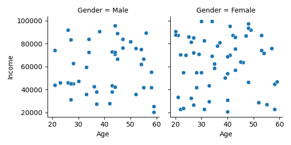

*🔹 Jupyter Code:[click here](../notebooks/02.%20Descriptive%20statistics.ipynb)*  

**📌 Interpretation:**

  - *Creates separate plots for males and females to compare distributions.*  

**📌 D. Pair Plots**

**How Does It Help?**

  - *A pairplot shows pairwise relationships between numerical variables using multiple scatterplots.*
  - *It automatically differentiates categories using hue.*

**🔹 Example:**

  - *Dataset: Age, Income, Spending Score*
  - *Hue (Category): Gender*

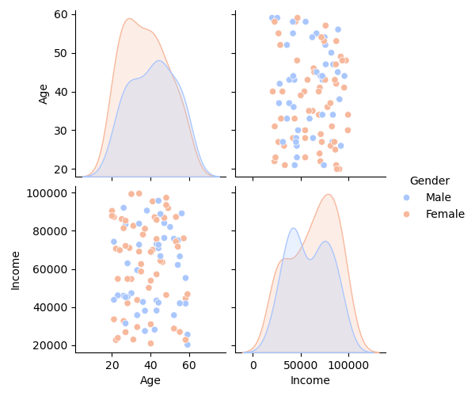

*🔹 Jupyter Code:[click here](../notebooks/02.%20Descriptive%20statistics.ipynb)*  

**📌 Interpretation:**

  - *Each scatter plot shows relationships between two variables.*  
  - *Diagonal plots show distributions.*  

**📌 E. Bubble Plot**

**How Does It Help?**

*A bubble plot is an extension of a scatter plot where the size of the bubble represents an additional variable.*

**🔹 Example:**

  - *X-axis: Age*
  - *Y-axis: Income*
  - *Bubble Size: Spending Score*

*🔹 Jupyter Code:[click here](../notebooks/02.%20Descriptive%20statistics.ipynb)*  

**📌 Interpretation:**

  - *Larger bubbles indicate higher spending scores.*
  - *Helps visualize 3 variables in 2D space.*

**📌 Summary of Multivariate Graphs**

| Graph Type        | Use Case                                         | Example Variables                       |
|-------------------|--------------------------------------------------|-----------------------------------------|
| 3D Scatter Plot   | Shows relationships between 3 numerical variables| Age, Income, Spending Score             |
| Hue Parameter     | Adds a categorical variable to a 2D scatter plot | Age, Income (Hue: Gender)               |
| FacetGrid         | Splits data into multiple small plots based on categories | Age, Income (Faceted by Gender)         |
| Pair Plots        | Shows relationships among all numerical variables | Age, Income, Spending Score             |
| Bubble Plot       | Scatter plot where bubble size represents a third variable | Age, Income, Spending Score             |

**🚀 Conclusion**

  - *Multivariate analysis helps uncover deeper insights by analyzing multiple variables simultaneously.*
  - *Different graphs suit different needs depending on categorical vs. numerical variables.*
  - *Mastering these techniques is crucial for advanced data analysis and machine learning.*