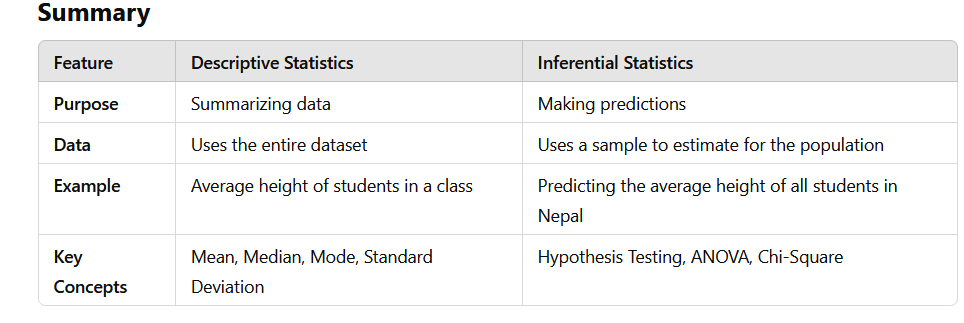

# Introduction to Statistics 📊

## 📋 Table of Contents

1. [📈 What is Statistics?](#-what-is-statistics)
   - [🔍 Breaking it Down](#-breaking-it-down)
   - [🌟 Example in Real Life](#-example-in-real-life)
   - [💡 Why is Statistics Important?](#-why-is-statistics-important)
   - [🤖 In Machine Learning & Data Science](#-in-machine-learning--data-science)
2. [📊 Types of Statistics](#-types-of-statistics)
   - [📝 Descriptive Statistics (Studying Past Data)](#-descriptive-statistics-studying-past-data)
   - [🔮 Inferential Statistics (Making Predictions & Inferences)](#-inferential-statistics-making-predictions--inferences)
3. [📁 Types of Data in Statistics](#-types-of-data-in-statistics)
   - [🏷️ Categorical (Qualitative) Data](#️-categorical-qualitative-data)
   - [🔢 Numerical (Quantitative) Data](#-numerical-quantitative-data)

---

## 📈 What is Statistics?

*Statistics is the science of collecting, organizing, analyzing, and interpreting data to make informed decisions.*

### 🔍 Breaking it Down:

1. **Collecting Data** → *Gathering information (e.g., survey responses, experiment results).*
2. **Organizing Data** → *Arranging data in tables, charts, or graphs.*
3. **Analyzing Data** → *Finding patterns, trends, and relationships.*
4. **Interpreting Data** → *Understanding what the numbers mean and using them to make decisions.*

### 🌟 Example in Real Life

*Imagine a teacher wants to know how well students performed in an exam.*

1. **Collecting**: *The teacher gathers students' scores.*
2. **Organizing**: *She/he creates a table of scores.*
3. **Analyzing**: *She/he calculates the average score and checks how many students passed or failed.*
4. **Interpreting**: *She/he realizes most students did well, so the exam was not too hard.*

### 💡 Why is Statistics Important?

1. *Helps businesses predict sales and customer behavior.*
2. *Allows doctors to study diseases and find treatments.*
3. *Used in machine learning to train models and make accurate predictions.*

### 🤖 In Machine Learning & Data Science

Statistics helps in:
- ✅ *Understanding data (mean, median, mode).*
- ✅ *Finding relationships (correlation, regression).*
- ✅ *Making predictions (probability, distributions).*

## 📊 Types of Statistics

Statistics is divided into two major types:

- **Descriptive Statistics** – *Summarizing and analyzing existing data.*
- **Inferential Statistics** – *Making predictions based on sample data.*

### 📝 Descriptive Statistics (Studying Past Data)

*Descriptive statistics is used to summarize existing data in a meaningful way, helping to organize, visualize, and identify patterns.*

💡 *Think of it like a report card – It tells you what has already happened!*

**Examples of Descriptive Statistics:**

- **Measures of Central Tendency (Where is the data centered?):**
  - *Mean (average score of students)*
  - *Median (middle score in a sorted list)*
  - *Mode (most frequently occurring score)*

- **Measures of Dispersion (How spread out is the data?):**
  - *Range (difference between max & min)*
  - *Variance & Standard Deviation (how much data points differ from the mean)*

- **Data Visualization:**
  - *Tables, charts, histograms, and box plots help understand data distribution.*

### 🔮 Inferential Statistics (Making Predictions & Inferences)

*Inferential statistics is used to make predictions or inferences about a population based on a sample.*

💡 *Think of it like election polling – Instead of asking every citizen, a small group is surveyed, and results are predicted for the whole country!*

**Understanding Sample & Population:**

- **Population** → *The entire group of interest (e.g., all students in Nepal).*
- **Sample** → *A smaller group chosen from the population (e.g., 500 students surveyed).*

👉 *We use a sample because collecting data from the entire population is often impractical.*

**Things to Consider When Creating a Sample:**

- **Randomness** – *Each member should have an equal chance of selection.*
- **Size** – *A larger sample usually leads to more accurate results.*
- **Representation** – *The sample should reflect the diversity of the population.*

**Inferential Statistics Techniques (Introduction Only):**

- **Hypothesis Testing** – *Checking if a claim about data is true (e.g., "Does a new drug really work?").*
- **ANOVA (Analysis of Variance)** – *Comparing means across multiple groups.*
- **Chi-Square Test** – *Checking relationships between categorical variables.*

## 📁 Types of Data in Statistics

In statistics, data is classified into two major types:

- **Categorical (Qualitative) Data** – *Represents labels, names, or categories.*
- **Numerical (Quantitative) Data** – *Represents measurable quantities.*

Each of these is further divided into subcategories.

### 🏷️ Categorical (Qualitative) Data

*Categorical data represents characteristics, labels, or groups that do not have a numerical meaning.*

💡 *Think of it as grouping things by name, not numbers.*

**Subtypes of Categorical Data:**

- 📌 **Nominal Data (No Order, Just Names)**

  - *Definition: Data that represents categories with no natural order or ranking.*
  - *Examples:*
    - *Colors of cars (Red, Blue, Green)*
    - *Types of animals (Dog, Cat, Elephant)*
    - *Blood groups (A, B, AB, O)*
  - *Key Feature: No logical sequence; one is not "greater" than another.*

- 📌 **Ordinal Data (Ordered but No Fixed Difference)**

  - *Definition: Data that has a meaningful order but the difference between values is not uniform.*
  - *Examples:*
    - *Education levels (Primary, Secondary, Higher Secondary, Bachelor's, Master's)*
    - *Satisfaction ratings (Poor, Average, Good, Excellent)*
    - *Military ranks (Lieutenant, Captain, Major, Colonel)*
  - *Key Feature: We can rank them, but we can't measure exact differences between them.*

### 🔢 Numerical (Quantitative) Data

*Numerical data represents measurable quantities that have a meaningful number value.*

💡 *Think of it as data that you can count or measure.*

**Subtypes of Numerical Data:**

- 📌 **Discrete Data (Countable, Whole Numbers Only)**

  - *Definition: Data that consists of countable, finite values (no decimals).*
  - *Examples:*
    - *Number of students in a class (30, 31, 32… but not 30.5)*
    - *Goals scored in a football match (1, 2, 3, … but not 2.5)*
    - *Number of mobile phones in a household (1, 2, 3, but not 1.7)*
  - *Key Feature: Cannot have fractions or decimals; only whole numbers.*

- 📌 **Continuous Data (Measurable, Can Have Decimals)**

  - *Definition: Data that can take any value within a range (including decimals).*
  - *Examples:*
    - *Height of students (5.7 feet, 5.8 feet, etc.)*
    - *Temperature (23.4°C, 25.1°C, etc.)*
    - *Weight of a person (60.5 kg, 72.3 kg, etc.)*
  - *Key Feature: Can have infinite possible values within a given range.*

---

*Happy Learning! 📊✨*
