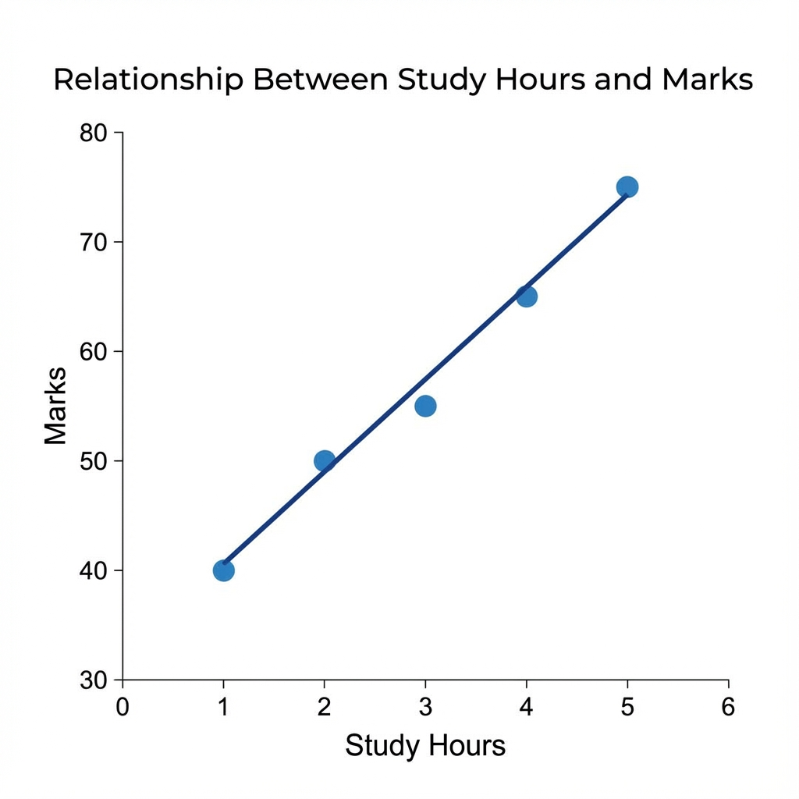
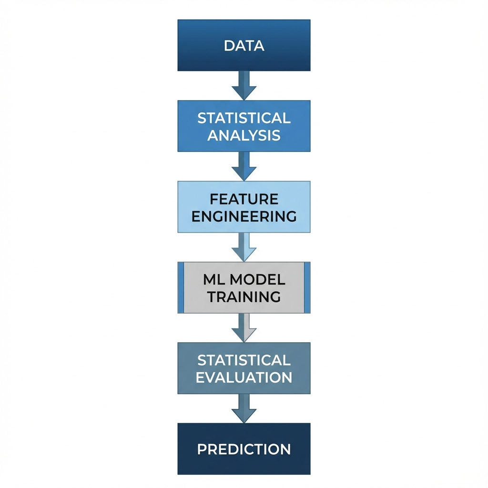

# **1. What Is Statistics?**

**Statistics** is the branch of science that deals with:

* **Collecting data**
* **Organizing data**
* **Analyzing data**
* **Interpreting data**
* **Presenting data**

In simple words:
👉 *Statistics helps us make sense of large amounts of information.*

It turns **raw numbers** into **useful knowledge**.

---

# **2. How Statistics Came Into Existence? (Origin)**

Statistics has existed for thousands of years.

### **Early History**

* Ancient kingdoms used statistics to count **population**, **crops**, **tax**, and **soldiers**.
* Egyptians used it for planning **pyramids**.
* Romans used it for **census** (population surveys).

### **Modern Statistics**

Modern statistics began around the **17th–18th century** when:

* Probability theory began developing.
* Governments needed to analyze large-scale data.
* Scientists started using numbers to validate experiments.

So statistics evolved because **humans needed better decision-making**.

---

# **3. Why Is Statistics Required in the General World?**

Statistics is used **everywhere** in daily life, even if we don’t notice it.

### Examples:

1. **Weather Forecasting**

   * Uses statistical models to predict rain, temperature, storms.

2. **Business Decisions**

   * Companies analyze customer data to decide:

     * What product to make
     * What price to set
     * Which ads work best

3. **Healthcare**

   * Doctors use statistics to measure the effectiveness of treatments.

4. **Government**

   * Used in elections, census, planning roads, hospitals, budgets.

5. **Sports**

   * Player performance analysis, rankings, predictions.

### In short:

👉 *Statistics helps us make decisions based on facts rather than guesswork.*

---

# **4. Role of Statistics in Machine Learning (ML)**

Machine Learning is based heavily on **statistics + computer algorithms**.

ML tries to make predictions from data, and statistics provides the **mathematical foundation**.

### **Key Roles of Statistics in ML**

### 1. **Understanding Data**

* Mean, median, variance
* Outliers
* Data distribution

ML models perform better if you understand the data statistically.

---

### 2. **Feature Selection**

Statistics helps identify:

* which variables (features) are important
* which are useless and add noise

Example:

* Predicting house price:

  * "Size" and "Location" matter
  * "Color of the door" does NOT matter
    Statistics helps detect this.

---

### 3. **Training Models**

ML algorithms rely on statistical ideas such as:

* Probability distributions
* Maximum likelihood
* Bayes theorem
* Statistical inference

Example:

* Logistic Regression is **pure statistics** (probability-based model).

---

### 4. **Evaluating Models**

Statistics helps measure how good a model is:

* Accuracy
* Precision
* Recall
* F1-score
* Confidence intervals

These are all statistical metrics.

---

### 5. **Detecting Overfitting**

Statistics helps compare:

* Training accuracy
* Testing accuracy

If the model performs too well on training but poorly on test data → overfitting.

---

# **5. Why Does Statistics Matter in ML? (With Example)**

### **Example: Predicting Student Exam Scores**

Suppose we want to predict exam marks from study hours.

We collect data:

| Study Hours | Marks |
| ----------- | ----- |
| 1           | 40    |
| 2           | 50    |
| 3           | 55    |
| 4           | 65    |
| 5           | 75    |

### Step 1: Plot the Data (Statistical visualization)

This figure tells us:

* More study hours → higher marks
* The relationship is almost linear

### Step 2: Apply ML Model

Using **Linear Regression**, the model finds the best line that represents this relationship.

### Step 3: Prediction

If a student studies **6 hours**, the model predicts around **85 marks** (statistical inference).

Without statistics, we could not:

* Plot the data
* Find the relationship
* Build the regression model
* Evaluate accuracy
* Make predictions

👉 **So ML = Statistics + Computation**

---

# **6. Simple Diagram: How Statistics Flows into Machine Learning**

---

# **Summary (Short & Clear)**

* **Statistics = Science of data**
* Helps convert raw numbers into meaningful information.
* Needed for decision-making in daily life, business, science, government, etc.
* In ML, statistics is used for:

  * Understanding data
  * Feature selection
  * Training algorithms
  * Evaluating models
  * Avoiding overfitting

👉 *Machine learning is impossible without statistics.*

---

If you want, I can also provide:

* **Real-life examples of statistics in ML**
* **Figures for probability, distributions, regression lines**
* **Short notes for exam preparation**
* **Powerful analogies to remember concepts**

Just tell me!
